# DeapSECURE Solution Notebooks Guide

Welcome to the DeapSECURE training program solution notebooks! This guide provides an overview of all solution notebooks created for hands-on learning in cryptography, machine learning, neural networks, big data, and parallel computing.

## 📚 Table of Contents

- [Overview](#overview)
- [Module Structure](#module-structure)
- [Getting Started](#getting-started)
- [Notebook Descriptions](#notebook-descriptions)
- [Learning Paths](#learning-paths)
- [Best Practices](#best-practices)
- [Troubleshooting](#troubleshooting)

---

## Overview

This repository contains **12+ solution notebooks** covering five major computing domains:

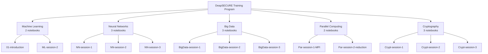

---

## Module Structure

### Directory Organization

```
code/
├── 01-introduction/
│   └── 01-introduction.ipynb          # ML fundamentals
├── module-ml/
│   ├── ML-session-2-solution.ipynb    # Data preprocessing
│   └── ML-session-3-solution.ipynb    # Feature selection & tuning
├── module-nn/
│   ├── NN-session-1-solution.ipynb    # Binary classification
│   ├── NN-session-2-solution.ipynb    # Multi-class classification
│   └── NN-session-3-solution.ipynb    # Hyperparameter tuning
├── module-bd/
│   ├── BigData-session-1-solution.ipynb   # Pandas fundamentals
│   ├── BigData-session-2-solution.ipynb   # Data wrangling
│   └── BigData-session-3-solution.ipynb   # Advanced wrangling
├── module-par/
│   ├── Par-session-1-MPI-solution.ipynb   # MPI fundamentals
│   └── Par-session-2-reduction-solution.ipynb  # Reduction operations
├── Crypt-session-1-solution.ipynb    # Data encoding
├── Crypt-session-2-solution.ipynb    # AES encryption
└── Crypt-session-3-solution.ipynb    # Paillier homomorphic encryption
```

---

## Getting Started

### Prerequisites

- Python 3.7+
- Jupyter Notebook or JupyterLab
- Required libraries (see individual notebook sections)

### Installation

```bash
# Clone or download the repository
cd code

# Install dependencies (varies by module)
pip install numpy pandas scikit-learn matplotlib seaborn
pip install tensorflow keras
pip install pycryptodome python-phe
pip install mpi4py  # For parallel computing
```

### Running Notebooks

```bash
# Start Jupyter
jupyter notebook

# Or use JupyterLab
jupyter lab

# Navigate to desired notebook and open it
```

---

## Notebook Descriptions

### 🔐 Cryptography Module (3 notebooks)

#### **Crypt-session-1-solution.ipynb** - Data Encoding & Representation

**What you'll learn:**
- Binary, hexadecimal, and decimal number systems
- String-to-bytes conversion with UTF-8 encoding
- Integer encoding/decoding for cryptographic operations
- Padding for block cipher compatibility

**Key Concepts:**
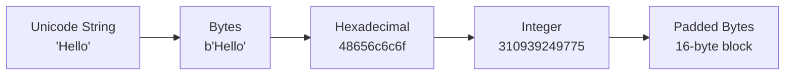

**Practical Skills:**
- Convert between data representations
- Understand byte-level operations
- Prepare data for encryption

**Duration:** 30-45 minutes

---

#### **Crypt-session-2-solution.ipynb** - AES Encryption & Decryption

**What you'll learn:**
- AES encryption fundamentals
- Educational vs. production implementations
- Encryption modes (ECB, EAX)
- Key security and performance analysis
- Brute-force attack estimation

**Key Concepts:**
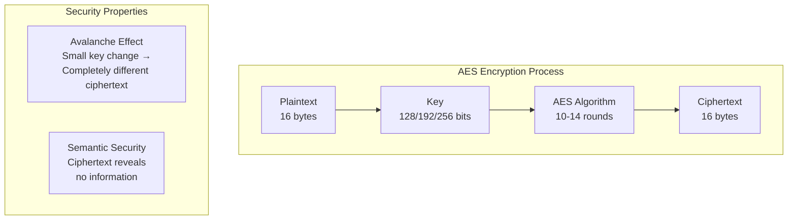

**Practical Skills:**
- Encrypt and decrypt messages
- Compare pure Python vs. optimized implementations
- Understand encryption modes
- Estimate key cracking time

**Performance Insights:**
- Pure Python: ~0.2ms per operation
- PyCryptodome: ~0.002ms per operation (100x faster!)
- 128-bit key: Computationally infeasible to crack

**Duration:** 45-60 minutes

---

#### **Crypt-session-3-solution.ipynb** - Paillier Homomorphic Encryption

**What you'll learn:**
- Asymmetric (public-key) cryptography
- Partially homomorphic encryption (PHE)
- Computation on encrypted data
- Privacy-preserving applications

**Key Concepts:**
```mermaid
graph TB
    subgraph "Paillier Cryptosystem"
        A["Generate Keys<br/>p, q primes<br/>n = p × q"] --> B["Public Key<br/>n, g"]
        A --> C["Private Key<br/>p, q"]
    end
    
    subgraph "Homomorphic Operations"
        D["E(m1) + E(m2)<br/>= E(m1 + m2)"] ✓
        E["E(m1) × k<br/>= E(m1 × k)"] ✓
        F["E(m1) × E(m2)<br/>NOT ALLOWED"] ✗
    end
```

**Practical Skills:**
- Generate and manage keypairs
- Encrypt/decrypt numbers
- Perform arithmetic on encrypted data
- Understand security-performance tradeoffs

**Use Cases:**
- Secure voting systems
- Privacy-preserving data analysis
- Federated learning
- Secure multi-party computation

**Duration:** 60-90 minutes

---

### 🤖 Machine Learning Module (2 notebooks)

#### **01-introduction.ipynb** - ML Fundamentals

**What you'll learn:**
- Supervised vs. unsupervised learning
- Regression and classification
- Bias-variance tradeoff
- Model evaluation metrics

**Key Topics:**
- Linear regression
- Logistic regression
- Decision trees
- K-means clustering
- Cross-validation

**Duration:** 60-90 minutes

---

#### **ML-session-2-solution.ipynb** - Data Preprocessing & Model Training

**What you'll learn:**
- Data cleaning and preparation
- Feature selection techniques
- Model comparison (Logistic Regression vs. Decision Tree)
- Real-world dataset handling

**Dataset:** Sherlock 2-apps dataset

**Duration:** 45-60 minutes

---

#### **ML-session-3-solution.ipynb** - Feature Selection & Hyperparameter Tuning

**What you'll learn:**
- Feature importance analysis
- Correlation analysis
- K-fold cross-validation
- Hyperparameter optimization

**Techniques:**
- Histogram-based feature analysis
- Group-based analysis
- Model tuning strategies

**Duration:** 45-60 minutes

---

### 🧠 Neural Networks Module (3 notebooks)

#### **NN-session-1-solution.ipynb** - Binary Classification

**What you'll learn:**
- Single-neuron neural networks
- Binary classification with Keras
- Comparison with traditional ML
- Training history visualization

**Architecture:**
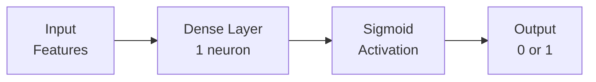

**Duration:** 45-60 minutes

---

#### **NN-session-2-solution.ipynb** - Multi-class Classification

**What you'll learn:**
- Multi-layer neural networks
- One-hot encoding
- Dropout regularization
- Achieving high accuracy (>99%)

**Dataset:** 18-apps classification

**Architecture:**
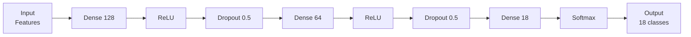

**Duration:** 60-90 minutes

---

#### **NN-session-3-solution.ipynb** - Hyperparameter Tuning

**What you'll learn:**
- Systematic hyperparameter optimization
- Network depth and width effects
- Learning rate impact
- Early stopping strategies

**Experiments:**
1. Baseline model
2. Deeper network
3. Wider network
4. Different learning rates
5. Early stopping

**Duration:** 60-90 minutes

---

### 📊 Big Data Module (3 notebooks)

#### **BigData-session-1-solution.ipynb** - Pandas Fundamentals

**What you'll learn:**
- Series and DataFrame operations
- Data loading and exploration
- Basic data manipulation
- Visualization with matplotlib/seaborn

**Key Operations:**
- Creating and indexing data structures
- Filtering and sorting
- Aggregation functions
- Data visualization

**Duration:** 45-60 minutes

---

#### **BigData-session-2-solution.ipynb** - Data Wrangling

**What you'll learn:**
- Advanced filtering and sorting
- Grouping and aggregation
- Data transformation
- Handling missing values

**Techniques:**
- Group-by operations
- Pivot tables
- Data reshaping
- Correlation analysis

**Duration:** 45-60 minutes

---

#### **BigData-session-3-solution.ipynb** - Advanced Data Wrangling

**What you'll learn:**
- Missing value strategies
- Data merging and joining
- Advanced aggregations
- Statistical analysis

**Topics:**
- Imputation techniques
- Join operations
- Pivot table creation
- Seaborn visualizations

**Duration:** 45-60 minutes

---

### ⚡ Parallel Computing Module (2 notebooks)

#### **Par-session-1-MPI-solution.ipynb** - MPI Fundamentals

**What you'll learn:**
- Message Passing Interface (MPI) basics
- Point-to-point communication
- Collective operations
- Master-worker patterns

**Key Concepts:**
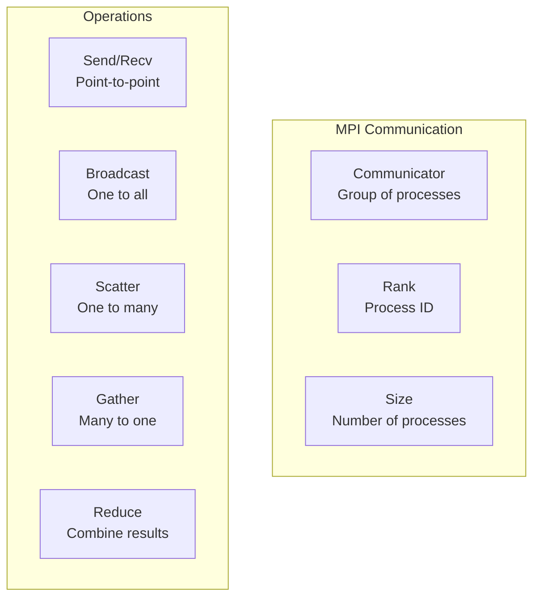

**Patterns:**
- Master-worker
- Data parallelism
- Pipeline parallelism

**Duration:** 60-90 minutes

---

#### **Par-session-2-reduction-solution.ipynb** - Reduction Operations

**What you'll learn:**
- Reduction algorithms
- Tree-based computation
- Scan operations
- Performance optimization

**Topics:**
- Parallel reduction
- Prefix sum (scan)
- Performance analysis
- Scalability considerations

**Duration:** 60-90 minutes

---

## Learning Paths

### 🎯 Path 1: Cryptography Fundamentals (3 hours)

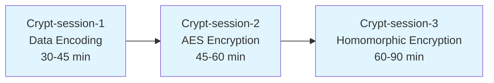

**Outcomes:**
- Understand data representation at byte level
- Encrypt/decrypt data securely
- Perform computation on encrypted data
- Understand security-performance tradeoffs

---

### 🎯 Path 2: Machine Learning Essentials (3-4 hours)

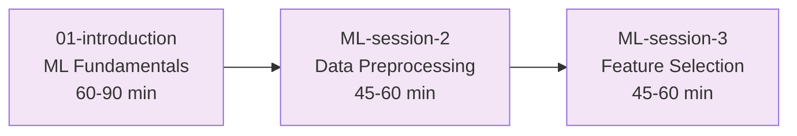

**Outcomes:**
- Understand ML concepts and algorithms
- Prepare data for modeling
- Select relevant features
- Optimize model performance

---

### 🎯 Path 3: Deep Learning (3-4 hours)

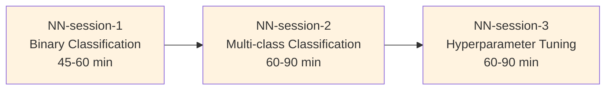

**Outcomes:**
- Build neural networks with Keras
- Handle multi-class classification
- Optimize network architecture
- Achieve high accuracy models

---

### 🎯 Path 4: Big Data Processing (2.5-3 hours)

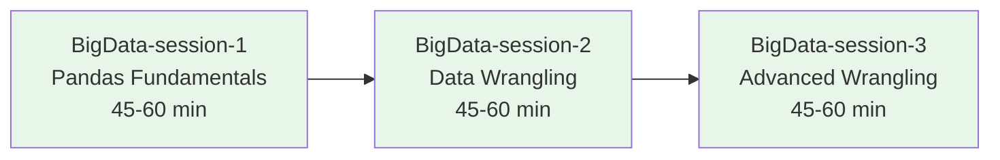

**Outcomes:**
- Master pandas for data manipulation
- Clean and prepare data
- Perform advanced data transformations
- Create meaningful visualizations

---

### 🎯 Path 5: Parallel Computing (2-3 hours)

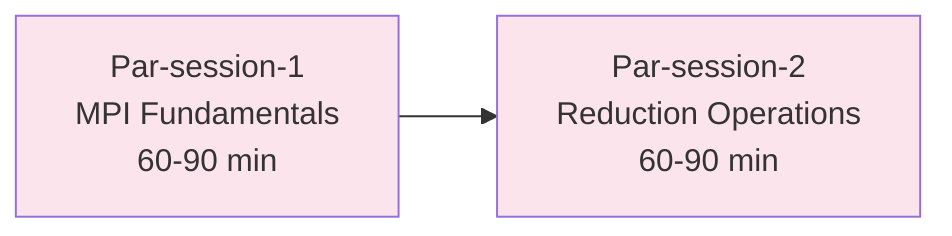

**Outcomes:**
- Understand distributed computing
- Write parallel programs with MPI
- Optimize parallel algorithms
- Analyze scalability

---

## Best Practices

### 📋 Before Starting a Notebook

1. **Read the introduction** - Understand the learning objectives
2. **Check prerequisites** - Ensure you have required libraries
3. **Review the structure** - Scan section headings
4. **Allocate time** - Don't rush through exercises

### 💻 While Working Through a Notebook

1. **Run cells sequentially** - Don't skip around
2. **Modify and experiment** - Change parameters and observe results
3. **Read explanations** - Understand the "why", not just the "how"
4. **Take notes** - Write down key concepts
5. **Try exercises** - Don't just read the solutions

### 🔍 After Completing a Notebook

1. **Review key concepts** - Summarize what you learned
2. **Try variations** - Modify code to test understanding
3. **Connect to real-world** - Think of applications
4. **Share knowledge** - Explain concepts to others
5. **Move to next notebook** - Follow the learning path

---

## Common Patterns Across Notebooks

### Data Representation Pattern

```python
# String → Bytes → Hex → Integer
text = "Hello"
bytes_data = text.encode('utf-8')
hex_data = bytes_data.hex()
int_data = int(hex_data, 16)
```

### Encryption Pattern

```python
# Encrypt
ciphertext = cipher.encrypt(plaintext)

# Decrypt
plaintext = cipher.decrypt(ciphertext)

# Verify
assert plaintext == original_message
```

### Model Training Pattern

```python
# Prepare data
X_train, X_test, y_train, y_test = train_test_split(X, y)

# Create model
model = create_model()

# Train
model.fit(X_train, y_train, epochs=10)

# Evaluate
accuracy = model.evaluate(X_test, y_test)
```

### Parallel Computing Pattern

```python
# Initialize MPI
comm = MPI.COMM_WORLD
rank = comm.Get_rank()
size = comm.Get_size()

# Distribute work
if rank == 0:
    # Master process
    data = distribute_data(size)
    comm.Scatter(data, ...)
else:
    # Worker process
    local_data = None
    comm.Scatter(None, local_data)
    result = process(local_data)
    comm.Gather(result, ...)
```

---

## Troubleshooting

### Common Issues and Solutions

#### Issue: "ModuleNotFoundError: No module named 'X'"

**Solution:**
```bash
pip install module_name
# or
pip install -r requirements.txt
```

#### Issue: "Kernel died" or "Out of memory"

**Solution:**
- Reduce dataset size
- Use smaller batch sizes
- Restart kernel and run cells sequentially
- Close other applications

#### Issue: "Results don't match expected output"

**Solution:**
- Check random seed is set
- Verify data preprocessing steps
- Compare with notebook output
- Check library versions

#### Issue: "MPI program won't run"

**Solution:**
```bash
# Install MPI
sudo apt-get install libopenmpi-dev

# Run with mpirun
mpirun -np 4 python script.py
```

#### Issue: "Jupyter notebook won't start"

**Solution:**
```bash
# Clear Jupyter cache
jupyter notebook --no-browser --ip=0.0.0.0

# Or use JupyterLab
jupyter lab
```

---

## Performance Expectations

### Typical Execution Times

| Notebook | Duration | Complexity |
|----------|----------|-----------|
| Crypt-session-1 | 30-45 min | Low |
| Crypt-session-2 | 45-60 min | Medium |
| Crypt-session-3 | 60-90 min | High |
| 01-introduction | 60-90 min | Medium |
| ML-session-2 | 45-60 min | Medium |
| ML-session-3 | 45-60 min | Medium |
| NN-session-1 | 45-60 min | Medium |
| NN-session-2 | 60-90 min | High |
| NN-session-3 | 60-90 min | High |
| BigData-session-1 | 45-60 min | Low |
| BigData-session-2 | 45-60 min | Medium |
| BigData-session-3 | 45-60 min | Medium |
| Par-session-1 | 60-90 min | High |
| Par-session-2 | 60-90 min | High |

**Total Time:** 12-16 hours for all notebooks

---

## Resources and References

### Cryptography
- [NIST AES Standard](https://nvlpubs.nist.gov/nistpubs/FIPS/NIST.FIPS.197.pdf)
- [Paillier Cryptosystem](https://en.wikipedia.org/wiki/Paillier_cryptosystem)
- [PyCryptodome Documentation](https://pycryptodome.readthedocs.io/)

### Machine Learning
- [Scikit-learn Documentation](https://scikit-learn.org/)
- [Pandas Documentation](https://pandas.pydata.org/)
- [Matplotlib/Seaborn](https://matplotlib.org/)

### Deep Learning
- [Keras Documentation](https://keras.io/)
- [TensorFlow Guide](https://www.tensorflow.org/guide)

### Parallel Computing
- [MPI Tutorial](https://mpitutorial.com/)
- [mpi4py Documentation](https://mpi4py.readthedocs.io/)

### Big Data
- [Pandas User Guide](https://pandas.pydata.org/docs/user_guide/index.html)
- [Data Wrangling Best Practices](https://www.oreilly.com/library/view/data-wrangling-with/9781491948584/)

---

## Contributing and Feedback

### How to Contribute

1. Test notebooks thoroughly
2. Report issues with clear descriptions
3. Suggest improvements
4. Share your solutions

### Reporting Issues

Include:
- Notebook name and section
- Error message (full traceback)
- Steps to reproduce
- Your environment (Python version, OS, etc.)

---

## License and Attribution

These notebooks are part of the **DeapSECURE** training program at Old Dominion University.

**Citation:**
```bibtex
@misc{deapsecure2024,
  title={DeapSECURE Training Program},
  author={Old Dominion University},
  year={2024},
  url={https://deapsecure.gitlab.io/}
}
```

---

## Quick Start Checklist

- [ ] Python 3.7+ installed
- [ ] Jupyter installed (`pip install jupyter`)
- [ ] Required libraries installed
- [ ] Notebooks downloaded
- [ ] First notebook opened
- [ ] First cell executed successfully
- [ ] Learning path selected
- [ ] Time allocated for learning

---

## Next Steps

1. **Choose a learning path** based on your interests
2. **Start with the first notebook** in your path
3. **Follow the exercises** and modify code
4. **Take notes** on key concepts
5. **Complete all notebooks** in the path
6. **Apply knowledge** to real-world problems
7. **Share your learning** with others

---

**Happy Learning! 🚀**

For questions or support, refer to the DeapSECURE website or contact your instructor.

Last Updated: December 2024
