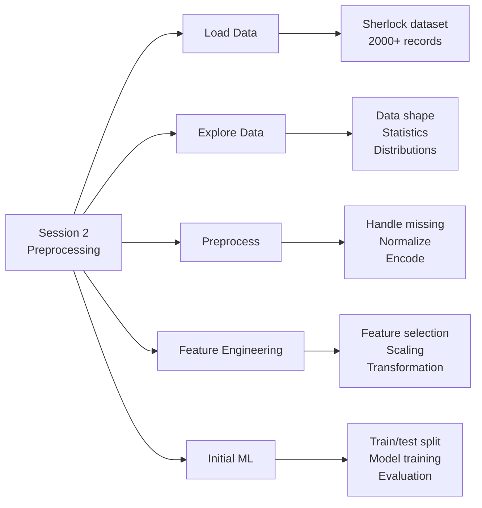
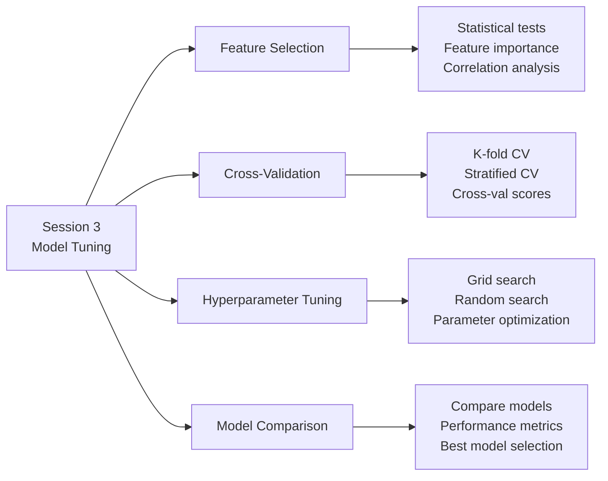
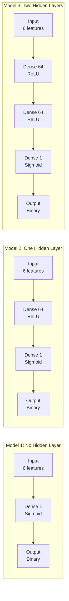
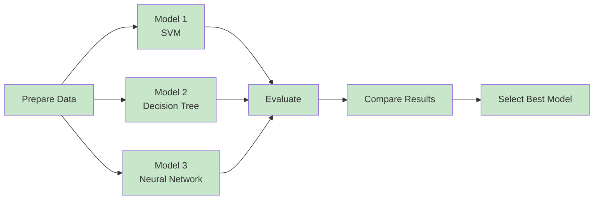
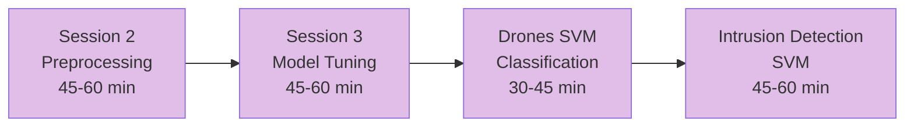
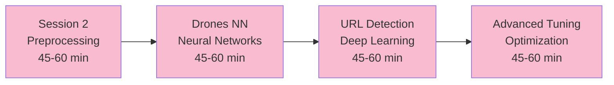

# Machine Learning Module (module-ml) - Complete Documentation

Welcome to the Machine Learning module documentation! This guide explains all code and data artifacts in the `module-ml` folder, designed for junior developers and students learning machine learning with scikit-learn, Keras, and Python.

## 📚 Table of Contents

- [Overview](#overview)
- [Folder Structure](#folder-structure)
- [Jupyter Notebooks](#jupyter-notebooks)
- [Python Scripts](#python-scripts)
- [Datasets](#datasets)
- [Learning Paths](#learning-paths)
- [Quick Start Guide](#quick-start-guide)

---

## Overview

The Machine Learning module teaches practical ML skills using **scikit-learn** and **Keras**, covering data preprocessing, model training, and hyperparameter tuning. This module covers:

```mermaid
graph TB
    ML["Machine Learning Module<br/>ML with scikit-learn & Keras"]
    
    ML --> Session2["Session 2<br/>Data Preprocessing"]
    ML --> Session3["Session 3<br/>Model Tuning"]
    
    Session2 --> Topics2["• Load Sherlock data<br/>• Data preprocessing<br/>• Feature engineering<br/>• Initial ML experiments"]
    Session3 --> Topics3["• Feature selection<br/>• Cross-validation<br/>• Hyperparameter tuning<br/>• Model comparison"]
    
    ML --> Scripts["Python Scripts<br/>Real-world Applications"]
    Scripts --> Apps["• Drones classification<br/>• Network intrusion detection<br/>• Malicious URL detection"]
    
    style ML fill:#f3e5f5
    style Session2 fill:#e1bee7
    style Session3 fill:#e1bee7
    style Scripts fill:#ce93d8
```



---

## Folder Structure

```
module-ml/
├── ML-session-2.ipynb                    # Data preprocessing
├── ML-session-3.ipynb                    # Model tuning
├── Drones/                               # Drone classification
│   ├── drones_svc.py                     # SVM classifier
│   └── drones_nn.py                      # Neural network classifier
├── Intrusion/                            # Network intrusion detection
│   └── intrusion_svm.py                  # SVM for IDS
├── Malicious-URL/                        # Malicious URL detection
│   ├── url_analyzer.py                   # URL feature extraction
│   ├── url_analyzer_script.py            # Script wrapper
│   ├── model01_train_test.py             # Model training
│   ├── test_inference.py                 # Model inference
│   └── url_job.sh                        # HPC job script
├── sherlock/                             # Mobile app classification
│   ├── sherlock_mystery_2apps.csv        # 2-app dataset (788k records)
│   ├── Prep_ML.py                        # Data preparation
│   ├── analysis_sherlock_ML.py           # Analysis utilities
│   ├── hackshop-ml.ipynb                 # Workshop notebook
│   └── 2apps_4f/                         # Labeled 2-app data
│       └── sherlock_2apps_labels.csv     # Labels (612k records)
├── expts-sherlock/                       # Sherlock experiments
│   ├── analysis_sherlock_ML.py           # Analysis script
│   ├── NN_Model-064n.py                  # Neural network model
│   ├── NN_Model-064n.wahab.job           # HPC job script
│   ├── outputs/                          # Results directory
│   ├── sherlock/                         # Data directory
│   └── _failed/                          # Failed job logs
└── keras-env-py3                         # Keras environment file
```

---

## Jupyter Notebooks

### 📓 ML-session-2.ipynb - Data Preprocessing for Machine Learning

**Duration:** 45-60 minutes  
**Difficulty:** Intermediate  
**Prerequisites:** Big Data module completion

#### Learning Objectives



#### Key Concepts

1. **Loading Sherlock Dataset**
   - Mobile app performance metrics
   - 2000+ records with 50+ features
   - CPU, memory, network metrics

2. **Data Preprocessing**
   - Handling missing values
   - Feature scaling and normalization
   - Categorical encoding

3. **Feature Engineering**
   - Feature selection techniques
   - Dimensionality reduction
   - Feature transformation

4. **Initial ML Experiments**
   - Train/test split
   - Model training (Logistic Regression, Decision Tree)
   - Model evaluation (accuracy, confusion matrix)

#### Datasets Used

- **sherlock_mystery_2apps.csv** - 788k records
  - 2 mobile applications
  - 50+ performance metrics
  - Purpose: Real-world ML practice

#### Exercises

- Load and explore Sherlock data
- Preprocess and clean data
- Engineer features
- Train initial models
- Compare model performance

---

### 📓 ML-session-3.ipynb - Tuning the Machine Learning Model

**Duration:** 45-60 minutes  
**Difficulty:** Intermediate-Advanced  
**Prerequisites:** Session 2 completion

#### Learning Objectives



#### Key Concepts

1. **Feature Selection**
   - Statistical significance testing
   - Feature importance ranking
   - Correlation analysis

2. **Cross-Validation**
   - K-fold cross-validation
   - Stratified cross-validation
   - Cross-validation scoring

3. **Hyperparameter Tuning**
   - Grid search
   - Random search
   - Parameter optimization

4. **Model Comparison**
   - Performance metrics
   - Model selection
   - Best practices

#### Exercises

- Select relevant features
- Perform cross-validation
- Tune hyperparameters
- Compare multiple models
- Optimize model performance

---

## Python Scripts

### 🐍 Drones Classification

#### drones_svc.py - SVM Classifier

**Purpose:** Classify drone types using Support Vector Machine

**Key Functions:**

```python
categorical_to_numerics(a, cats=None)
    # Convert categorical labels to numeric values
    
prepare_data(data_home, file_name, ratio=.8)
    # Load and split drone dataset
    
train_model(model, training_data, training_labels)
    # Train SVM model
    
model_predict(model, testing_fm)
    # Make predictions
    
repeat_model(rep=10)
    # Run multiple experiments
```

**Workflow:**
1. Load drone dataset
2. Split into train/test
3. Train SVM classifier
4. Evaluate performance
5. Repeat with different ratios

**Output:**
- Confusion matrix
- Accuracy score
- Model performance metrics

---

#### drones_nn.py - Neural Network Classifier

**Purpose:** Classify drones using deep learning

**Key Functions:**

```python
Model01_dense_no_hidden(inp_len=6)
    # Single layer neural network
    
Model02_dense_1(inp_len=6, hidden_len=64)
    # One hidden layer network
    
Model03_dense_2(inp_len=6, hidden_len=64)
    # Two hidden layer network
    
optimize_model(model, epochs=5, batch_size=32)
    # Train neural network
    
print_layers_dims(model)
    # Display layer dimensions
```

**Model Architectures:**



**Training:**
- Optimizer: Adam
- Loss: Binary crossentropy
- Metrics: Accuracy
- Epochs: 5
- Batch size: 32

---

### 🐍 Intrusion Detection

#### intrusion_svm.py - Network Intrusion Detection

**Purpose:** Detect network intrusions using SVM

**Dataset:** CIC-IDS-2017

**Key Functions:**

```python
flowmeter_load_csv_pd(filename)
    # Load network flow data
    
delete_bad_numerics(df, inplace=False)
    # Remove NaN and Inf values
    
detect_bad_numeric_columns(df)
    # Identify problematic columns
    
load_data(data_home, filename)
    # Load and clean dataset
    
prepare_input(data_frame, split_testing=0.2)
    # Prepare training/testing data
    
svm_model_fit(training_feature_matrix, training_labels)
    # Train SVM classifier
    
model_test(test_feature_matrix, model)
    # Test model performance
```

**Features:** 80+ network flow metrics
- Packet statistics
- Byte statistics
- Inter-arrival times
- TCP flags
- Protocol information

**Workflow:**
1. Load network flow data
2. Clean bad values
3. Prepare features
4. Train SVM
5. Evaluate accuracy

**Output:**
- Confusion matrix
- Accuracy score
- Attack classification

---

### 🐍 Malicious URL Detection

#### url_analyzer.py - URL Feature Extraction

**Purpose:** Extract features from URLs for classification

**Key Features:**
- URL length
- Domain characteristics
- Special characters
- Protocol information
- Path structure

#### model01_train_test.py - Model Training

**Purpose:** Train and test URL classification model

**Workflow:**
1. Extract URL features
2. Prepare training data
3. Train deep learning model
4. Evaluate performance

#### test_inference.py - Model Inference

**Purpose:** Test trained model on new URLs

**Usage:**
```bash
python test_inference.py <url>
```

#### url_job.sh - HPC Job Script

**Purpose:** Submit URL analysis job to HPC cluster

**Usage:**
```bash
sbatch url_job.sh
```

---

### 🐍 Sherlock Analysis

#### analysis_sherlock_ML.py - Analysis Utilities

**Purpose:** Utility functions for Sherlock data analysis

**Key Functions:**
- Data summarization
- Feature preprocessing
- One-hot encoding
- Feature scaling
- Label encoding

#### Prep_ML.py - Data Preparation

**Purpose:** Prepare Sherlock data for ML

**Workflow:**
1. Load Sherlock dataset
2. Summarize data
3. Preprocess features
4. Encode labels
5. Scale features

---

## Datasets

### 1. Sherlock - Mobile App Performance

**Purpose:** Classify mobile applications by resource usage

**Files:**
- sherlock_mystery_2apps.csv (788k records)
- sherlock_2apps_labels.csv (612k labels)

**Features:** 50+ metrics
- CPU usage
- Memory metrics
- Network I/O
- Process information
- Thread count
- Virtual memory

**Applications:** Facebook, WhatsApp, Gmail, etc.

**Use Cases:**
- App classification
- Performance analysis
- Resource usage patterns
- Anomaly detection

---

### 2. Drones Dataset

**Purpose:** Classify drone types

**Location:** `/scratch-lustre/DeapSECURE/module03/Drones/data/`

**File:** machinelearningdata.csv

**Features:** 6+ metrics
- Flight characteristics
- Sensor readings
- Performance metrics

**Classes:** Multiple drone types

**Use Cases:**
- Drone classification
- Model comparison (SVM vs NN)
- Performance benchmarking

---

### 3. Network Intrusion (CIC-IDS-2017)

**Purpose:** Detect network intrusions

**Location:** `/scratch-lustre/DeapSECURE/module02/CIC-IDS-2017/`

**File:** Tuesday-WorkingHours.pcap_ISCX.csv

**Features:** 80+ network flow metrics
- Packet statistics
- Byte statistics
- Inter-arrival times
- TCP flags
- Protocol information

**Classes:** Normal, Attack types

**Use Cases:**
- Intrusion detection
- Anomaly detection
- Network security
- Attack classification

---

### 4. Malicious URLs

**Purpose:** Detect malicious URLs

**Features:** URL characteristics
- Length
- Domain info
- Special characters
- Protocol
- Path structure

**Classes:** Benign, Malicious

**Use Cases:**
- URL classification
- Phishing detection
- Malware prevention

---

## Data Processing Workflows

### Workflow 1: ML Pipeline


---

### Workflow 2: Model Comparison



---

## Learning Paths

### Path 1: Supervised Learning (3-4 hours)



**Outcomes:**
- Understand ML pipeline
- Preprocess real data
- Train and tune models
- Compare algorithms
- Detect intrusions

---

### Path 2: Deep Learning (3-4 hours)



**Outcomes:**
- Build neural networks
- Train deep models
- Optimize architectures
- Detect malicious URLs

---

## Quick Start Guide

### For Beginners

**Step 1: Set Up Environment**
```bash
pip install pandas numpy scikit-learn keras tensorflow matplotlib seaborn jupyter
```

**Step 2: Start Jupyter**
```bash
jupyter notebook
```

**Step 3: Open Session 2**
- Navigate to `ML-session-2.ipynb`
- Run cells sequentially
- Understand data preprocessing

**Step 4: Practice with Sherlock Data**
```python
import pandas as pd
df = pd.read_csv('sherlock/sherlock_mystery_2apps.csv')
print(df.shape)
print(df.describe())
```

---

### For Intermediate Learners

**Step 1: Complete Session 2**
- Understand preprocessing
- Learn feature engineering

**Step 2: Complete Session 3**
- Learn model tuning
- Understand cross-validation

**Step 3: Run Drones SVM**
```bash
python Drones/drones_svc.py
```

**Step 4: Analyze Results**
- Compare model performance
- Understand confusion matrix

---

### For Advanced Learners

**Step 1: Complete Sessions 2-3**

**Step 2: Run Intrusion Detection**
```bash
python Intrusion/intrusion_svm.py
```

**Step 3: Run Drones Neural Network**
```bash
python Drones/drones_nn.py
```

**Step 4: Experiment with Malicious URLs**
```bash
python Malicious-URL/model01_train_test.py
```

**Step 5: Submit HPC Jobs**
```bash
sbatch Malicious-URL/url_job.sh
sbatch expts-sherlock/NN_Model-064n.wahab.job
```

---

## Common Tasks and Solutions

### Task 1: Load and Explore Data

```python
import pandas as pd
import numpy as np

# Load
df = pd.read_csv('sherlock/sherlock_mystery_2apps.csv')

# Explore
print(f"Shape: {df.shape}")
print(f"Columns: {df.columns.tolist()}")
print(df.head())
print(df.describe())
print(df.info())
```

---

### Task 2: Preprocess Data

```python
from sklearn import preprocessing

# Handle missing values
df = df.dropna()

# Normalize features
scaler = preprocessing.StandardScaler()
X_scaled = scaler.fit_transform(X)

# Encode labels
le = preprocessing.LabelEncoder()
y_encoded = le.fit_transform(y)
```

---

### Task 3: Train and Evaluate Model

```python
from sklearn.model_selection import train_test_split
from sklearn.svm import SVC
from sklearn.metrics import confusion_matrix, accuracy_score

# Split data
X_train, X_test, y_train, y_test = train_test_split(X, y, test_size=0.2)

# Train
model = SVC()
model.fit(X_train, y_train)

# Evaluate
y_pred = model.predict(X_test)
print(confusion_matrix(y_test, y_pred))
print(accuracy_score(y_test, y_pred))
```

---

### Task 4: Cross-Validation

```python
from sklearn.model_selection import cross_val_score

# K-fold cross-validation
scores = cross_val_score(model, X, y, cv=5)
print(f"Scores: {scores}")
print(f"Mean: {scores.mean()}")
print(f"Std: {scores.std()}")
```

---

### Task 5: Hyperparameter Tuning

```python
from sklearn.model_selection import GridSearchCV

# Define parameters
params = {
    'C': [0.1, 1, 10],
    'kernel': ['linear', 'rbf']
}

# Grid search
grid = GridSearchCV(SVC(), params, cv=5)
grid.fit(X_train, y_train)

print(f"Best params: {grid.best_params_}")
print(f"Best score: {grid.best_score_}")
```

---

### Task 6: Build Neural Network

```python
from keras.models import Sequential
from keras.layers import Dense
from keras.optimizers import Adam

# Create model
model = Sequential([
    Dense(64, activation='relu', input_dim=50),
    Dense(32, activation='relu'),
    Dense(1, activation='sigmoid')
])

# Compile
model.compile(
    optimizer=Adam(lr=0.001),
    loss='binary_crossentropy',
    metrics=['accuracy']
)

# Train
model.fit(X_train, y_train, epochs=10, batch_size=32)
```

---

## Troubleshooting

### Issue: "ModuleNotFoundError: No module named 'sklearn'"

**Solution:**
```bash
pip install scikit-learn
```

---

### Issue: "No module named 'keras'"

**Solution:**
```bash
pip install keras tensorflow
```

---

### Issue: "Memory error with large dataset"

**Solution:**
```python
# Read in chunks
chunks = pd.read_csv('large_file.csv', chunksize=10000)
for chunk in chunks:
    process(chunk)

# Use specific columns
df = pd.read_csv('file.csv', usecols=['col1', 'col2'])
```

---

### Issue: "Model not converging"

**Solution:**
- Normalize features
- Adjust learning rate
- Increase epochs
- Check data quality

---

## Resources

### Official Documentation
- [Scikit-learn](https://scikit-learn.org/)
- [Keras](https://keras.io/)
- [TensorFlow](https://www.tensorflow.org/)
- [Pandas](https://pandas.pydata.org/)

### Tutorials
- [Scikit-learn Tutorial](https://scikit-learn.org/stable/tutorial/)
- [Keras Guide](https://keras.io/guides/)

### Cheat Sheets
- [Scikit-learn Cheat Sheet](https://scikit-learn.org/stable/tutorial/)
- [Pandas Cheat Sheet](https://pandas.pydata.org/Pandas_Cheat_Sheet.pdf)

---

## Summary

The Machine Learning module teaches practical ML skills through:

1. **Session 2** - Data preprocessing and initial experiments
2. **Session 3** - Model tuning and optimization
3. **Python Scripts** - Real-world applications (drones, intrusion, URLs)
4. **Datasets** - Sherlock, drones, network intrusion, malicious URLs

**Key Skills:**
- Data preprocessing
- Feature engineering
- Model training
- Hyperparameter tuning
- Model evaluation
- Deep learning

**Next Steps:**
1. Complete both sessions
2. Run Python scripts
3. Experiment with parameters
4. Compare models
5. Apply to your own data

---

**Happy Machine Learning! 🤖**

For questions or issues, refer to official documentation or ask your instructor.

Last Updated: December 2024
