# Parallel Computing Module (module-par) - Complete Documentation

Welcome to the Parallel Computing module documentation! This guide explains all code and data artifacts in the `module-par` folder, designed for junior developers and students learning parallel programming with MPI and Python.

## 📚 Table of Contents

- [Overview](#overview)
- [Folder Structure](#folder-structure)
- [Jupyter Notebooks](#jupyter-notebooks)
- [Python Scripts](#python-scripts)
- [Learning Paths](#learning-paths)
- [Quick Start Guide](#quick-start-guide)
- [Common Tasks](#common-tasks)
- [Troubleshooting](#troubleshooting)
- [Resources](#resources)

---

## Overview

The Parallel Computing module teaches distributed computing fundamentals using **MPI (Message Passing Interface)** and **Python**, covering point-to-point communication, collective operations, and reduction algorithms. This module covers:

```mermaid
graph TB
    PAR["Parallel Computing Module<br/>MPI with Python & mpi4py"]
    
    PAR --> Session1["Session 1<br/>MPI Fundamentals"]
    PAR --> Session2["Session 2<br/>Reduction Operations"]
    
    Session1 --> Topics1["• MPI basics<br/>• Communicators<br/>• Rank & size<br/>• Point-to-point communication<br/>• Collective operations"]
    Session2 --> Topics2["• Reduction operations<br/>• Tree-based algorithms<br/>• Scan operations<br/>• Performance analysis<br/>• Optimization"]
    
    style PAR fill:#f3e5f5
    style Session1 fill:#e1bee7
    style Session2 fill:#e1bee7
```



---

## Folder Structure

```
module-par/
├── Par-session-1-MPI.ipynb               # MPI fundamentals
├── Par-session-2-reduction.ipynb         # Reduction operations
├── parallel_prog_env.py                  # Environment setup
├── parallel-prog-env                     # Environment file
├── mpi4py/                               # MPI4py examples
│   └── (empty - for user experiments)
├── reduction/                            # Reduction examples
│   └── (empty - for user experiments)
├── phe_image/                            # Docker images
│   └── (empty - for container setup)
├── phe_image_par/                        # Parallel Docker images
│   └── (empty - for container setup)
└── images/                               # Documentation images
    └── (empty - for diagrams)
```

---

## Jupyter Notebooks

### 📓 Par-session-1-MPI.ipynb - MPI Fundamentals

**Duration:** 60-90 minutes  
**Difficulty:** Intermediate  
**Prerequisites:** Basic Python knowledge

#### Learning Objectives


#### Key Concepts

1. **MPI Fundamentals**
   - Message Passing Interface
   - Distributed memory computing
   - Process-based parallelism
   - Communication patterns

2. **Communicators**
   - MPI_COMM_WORLD
   - Process rank
   - Process size
   - Group management

3. **Point-to-Point Communication**
   - Send operations
   - Receive operations
   - Blocking communication
   - Non-blocking communication
   - Message tags

4. **Collective Operations**
   - Broadcast (one-to-all)
   - Scatter (one-to-many)
   - Gather (many-to-one)
   - Allreduce (all-to-all)
   - Barrier synchronization

#### Topics Covered

1. **MPI Initialization**
   ```python
   from mpi4py import MPI
   
   comm = MPI.COMM_WORLD
   rank = comm.Get_rank()
   size = comm.Get_size()
   ```

2. **Point-to-Point Communication**
   ```python
   if rank == 0:
       data = [1, 2, 3, 4, 5]
       comm.send(data, dest=1)
   elif rank == 1:
       data = comm.recv(source=0)
   ```

3. **Collective Operations**
   ```python
   # Broadcast
   data = comm.bcast(data if rank == 0 else None, root=0)
   
   # Scatter
   data = comm.scatter(data if rank == 0 else None, root=0)
   
   # Gather
   all_data = comm.gather(data, root=0)
   
   # Allreduce
   total = comm.allreduce(local_sum, op=MPI.SUM)
   ```

#### Exercises

- Initialize MPI environment
- Get rank and size
- Send/receive messages
- Broadcast data
- Scatter and gather
- Perform collective operations

---

### 📓 Par-session-2-reduction.ipynb - Reduction Operations

**Duration:** 60-90 minutes  
**Difficulty:** Intermediate-Advanced  
**Prerequisites:** Session 1 completion

#### Learning Objectives


#### Key Concepts

1. **Reduction Operations**
   - Sum, Min, Max
   - Product, Logical operations
   - Custom reduction functions
   - Data type handling

2. **Tree-Based Algorithms**
   - Binary tree reduction
   - Butterfly network
   - Hypercube topology
   - Communication patterns

3. **Scan Operations**
   - Prefix sum
   - Inclusive scan
   - Exclusive scan
   - Parallel prefix

4. **Performance Analysis**
   - Timing measurements
   - Scalability analysis
   - Communication overhead
   - Optimization techniques

#### Topics Covered

1. **Basic Reduction**
   ```python
   from mpi4py import MPI
   
   comm = MPI.COMM_WORLD
   rank = comm.Get_rank()
   
   local_sum = rank + 1
   global_sum = comm.allreduce(local_sum, op=MPI.SUM)
   ```

2. **Tree-Based Reduction**
   ```python
   # Binary tree reduction
   def tree_reduce(data, comm):
       rank = comm.Get_rank()
       size = comm.Get_size()
       
       for step in range(size.bit_length()):
           if rank % (2 ** (step + 1)) == 0:
               # Receive from partner
               partner = rank + 2 ** step
               if partner < size:
                   data += comm.recv(source=partner)
           else:
               # Send to partner
               partner = rank - 2 ** step
               comm.send(data, dest=partner)
               break
   ```

3. **Scan Operations**
   ```python
   # Prefix sum (inclusive scan)
   local_sum = rank + 1
   prefix_sum = comm.scan(local_sum, op=MPI.SUM)
   
   # Exclusive scan
   exclusive_sum = comm.exscan(local_sum, op=MPI.SUM)
   ```

4. **Performance Measurement**
   ```python
   import time
   
   start = MPI.Wtime()
   result = comm.allreduce(data, op=MPI.SUM)
   end = MPI.Wtime()
   
   elapsed = end - start
   ```

#### Exercises

- Implement reduction operations
- Compare tree algorithms
- Implement scan operations
- Measure performance
- Analyze scalability
- Optimize communication

---

## Python Scripts

### 🐍 parallel_prog_env.py - Environment Setup

**Purpose:** Configure parallel programming environment

**Key Functions:**

```python
setup_mpi_environment()
    # Initialize MPI environment
    
check_mpi_installation()
    # Verify mpi4py installation
    
get_system_info()
    # Get system and MPI information
    
configure_environment()
    # Set environment variables
```

**Usage:**
```bash
python parallel_prog_env.py
```

---

## MPI Concepts and Patterns

### Pattern 1: Master-Worker


**Implementation:**
```python
from mpi4py import MPI

comm = MPI.COMM_WORLD
rank = comm.Get_rank()
size = comm.Get_size()

if rank == 0:
    # Master process
    for i in range(1, size):
        task = prepare_task(i)
        comm.send(task, dest=i)
    
    # Collect results
    results = []
    for i in range(1, size):
        result = comm.recv(source=i)
        results.append(result)
else:
    # Worker process
    task = comm.recv(source=0)
    result = process_task(task)
    comm.send(result, dest=0)
```

---

### Pattern 2: Pipeline


**Implementation:**
```python
from mpi4py import MPI

comm = MPI.COMM_WORLD
rank = comm.Get_rank()
size = comm.Get_size()

# Receive from previous stage
if rank > 0:
    data = comm.recv(source=rank - 1)
else:
    data = initial_data()

# Process data
processed = process_stage(data)

# Send to next stage
if rank < size - 1:
    comm.send(processed, dest=rank + 1)
```

---

### Pattern 3: Collective Communication


**Implementation:**
```python
from mpi4py import MPI

comm = MPI.COMM_WORLD
rank = comm.Get_rank()

# Broadcast
data = comm.bcast(data if rank == 0 else None, root=0)

# Scatter
local_data = comm.scatter(data if rank == 0 else None, root=0)

# Gather
all_data = comm.gather(local_data, root=0)

# Allreduce
total = comm.allreduce(local_sum, op=MPI.SUM)
```

---

## Learning Paths

### Path 1: MPI Fundamentals (2-3 hours)


**Outcomes:**
- Understand MPI concepts
- Initialize MPI programs
- Send/receive messages
- Use collective operations

---

### Path 2: Reduction Algorithms (3-4 hours)


**Outcomes:**
- Reduction operations
- Tree-based algorithms
- Scan operations
- Performance optimization

---

### Path 3: Advanced Patterns (4-5 hours)


**Outcomes:**
- Communication patterns
- Scalable algorithms
- Performance optimization
- Real-world applications

---

## Quick Start Guide

### For Beginners

**Step 1: Install MPI and mpi4py**
```bash
# macOS
brew install open-mpi
pip install mpi4py

# Linux
sudo apt-get install libopenmpi-dev
pip install mpi4py
```

**Step 2: Verify Installation**
```bash
python parallel_prog_env.py
```

**Step 3: Start Jupyter**
```bash
jupyter notebook
```

**Step 4: Open Session 1**
- Navigate to `Par-session-1-MPI.ipynb`
- Run cells sequentially
- Understand MPI basics

**Step 5: Run First MPI Program**
```bash
mpirun -np 4 python -c "
from mpi4py import MPI
comm = MPI.COMM_WORLD
print(f'Rank {comm.Get_rank()} of {comm.Get_size()}')
"
```

---

### For Intermediate Learners

**Step 1: Complete Session 1**
- Understand MPI concepts
- Learn communication patterns

**Step 2: Write Point-to-Point Program**
```python
from mpi4py import MPI

comm = MPI.COMM_WORLD
rank = comm.Get_rank()

if rank == 0:
    data = [1, 2, 3, 4, 5]
    comm.send(data, dest=1)
    print(f"Rank {rank} sent data")
elif rank == 1:
    data = comm.recv(source=0)
    print(f"Rank {rank} received {data}")
```

**Step 3: Run with Multiple Processes**
```bash
mpirun -np 2 python my_program.py
```

**Step 4: Complete Session 2**
- Learn reduction operations
- Understand tree algorithms

---

### For Advanced Learners

**Step 1: Complete Sessions 1-2**

**Step 2: Implement Master-Worker Pattern**
```python
from mpi4py import MPI

comm = MPI.COMM_WORLD
rank = comm.Get_rank()
size = comm.Get_size()

if rank == 0:
    # Master
    for i in range(1, size):
        task = i * 10
        comm.send(task, dest=i)
    
    results = []
    for i in range(1, size):
        result = comm.recv(source=i)
        results.append(result)
    print(f"Results: {results}")
else:
    # Worker
    task = comm.recv(source=0)
    result = task * 2
    comm.send(result, dest=0)
```

**Step 3: Implement Reduction Algorithm**
```python
from mpi4py import MPI

comm = MPI.COMM_WORLD
rank = comm.Get_rank()

local_sum = rank + 1
global_sum = comm.allreduce(local_sum, op=MPI.SUM)

if rank == 0:
    print(f"Global sum: {global_sum}")
```

**Step 4: Measure Performance**
```python
from mpi4py import MPI
import time

comm = MPI.COMM_WORLD
rank = comm.Get_rank()

start = MPI.Wtime()
result = comm.allreduce(rank, op=MPI.SUM)
end = MPI.Wtime()

if rank == 0:
    print(f"Time: {end - start:.6f} seconds")
```

---

## Common Tasks and Solutions

### Task 1: Initialize MPI

```python
from mpi4py import MPI

comm = MPI.COMM_WORLD
rank = comm.Get_rank()
size = comm.Get_size()

print(f"Process {rank} of {size}")
```

---

### Task 2: Send and Receive

```python
from mpi4py import MPI

comm = MPI.COMM_WORLD
rank = comm.Get_rank()

if rank == 0:
    data = "Hello from rank 0"
    comm.send(data, dest=1)
elif rank == 1:
    data = comm.recv(source=0)
    print(f"Received: {data}")
```

---

### Task 3: Broadcast Data

```python
from mpi4py import MPI

comm = MPI.COMM_WORLD
rank = comm.Get_rank()

if rank == 0:
    data = [1, 2, 3, 4, 5]
else:
    data = None

data = comm.bcast(data, root=0)
print(f"Rank {rank}: {data}")
```

---

### Task 4: Scatter and Gather

```python
from mpi4py import MPI

comm = MPI.COMM_WORLD
rank = comm.Get_rank()
size = comm.Get_size()

if rank == 0:
    data = list(range(size * 2))
else:
    data = None

local_data = comm.scatter(data, root=0)
print(f"Rank {rank}: {local_data}")

all_data = comm.gather(local_data * 2, root=0)
if rank == 0:
    print(f"Gathered: {all_data}")
```

---

### Task 5: Reduction Operations

```python
from mpi4py import MPI

comm = MPI.COMM_WORLD
rank = comm.Get_rank()

local_value = rank + 1

# Sum
total = comm.allreduce(local_value, op=MPI.SUM)

# Min
minimum = comm.allreduce(local_value, op=MPI.MIN)

# Max
maximum = comm.allreduce(local_value, op=MPI.MAX)

if rank == 0:
    print(f"Sum: {total}, Min: {minimum}, Max: {maximum}")
```

---

### Task 6: Scan Operations

```python
from mpi4py import MPI

comm = MPI.COMM_WORLD
rank = comm.Get_rank()

local_value = rank + 1

# Inclusive scan (prefix sum)
prefix_sum = comm.scan(local_value, op=MPI.SUM)

# Exclusive scan
exclusive_sum = comm.exscan(local_value, op=MPI.SUM)

print(f"Rank {rank}: inclusive={prefix_sum}, exclusive={exclusive_sum}")
```

---

### Task 7: Measure Performance

```python
from mpi4py import MPI
import time

comm = MPI.COMM_WORLD
rank = comm.Get_rank()
size = comm.Get_size()

# Warm up
for _ in range(10):
    comm.allreduce(rank, op=MPI.SUM)

# Measure
start = MPI.Wtime()
for _ in range(1000):
    result = comm.allreduce(rank, op=MPI.SUM)
end = MPI.Wtime()

elapsed = end - start
if rank == 0:
    print(f"Time for 1000 allreduce: {elapsed:.6f} seconds")
    print(f"Average per operation: {elapsed/1000*1e6:.2f} microseconds")
```

---

## Troubleshooting

### Issue: "mpirun: command not found"

**Solution:**
```bash
# macOS
brew install open-mpi

# Linux
sudo apt-get install openmpi-bin libopenmpi-dev

# Verify
mpirun --version
```

---

### Issue: "ModuleNotFoundError: No module named 'mpi4py'"

**Solution:**
```bash
pip install mpi4py
```

---

### Issue: "MPI_Init has not been called"

**Solution:**
Ensure you're running with `mpirun`:
```bash
# Wrong
python my_program.py

# Correct
mpirun -np 4 python my_program.py
```

---

### Issue: "Deadlock - program hangs"

**Solution:**
- Check send/receive order
- Ensure all processes participate in collective operations
- Use non-blocking communication if needed

```python
# Blocking (can deadlock)
comm.send(data, dest=1)
data = comm.recv(source=0)

# Non-blocking (safer)
req_send = comm.isend(data, dest=1)
req_recv = comm.irecv(source=0)
req_send.wait()
data = req_recv.wait()
```

---

### Issue: "Segmentation fault"

**Solution:**
- Check data types match
- Verify buffer sizes
- Use proper MPI data types

```python
# Correct
import numpy as np
data = np.array([1, 2, 3], dtype=np.int32)
comm.send(data, dest=1)

# Receive
received = np.empty(3, dtype=np.int32)
comm.Recv(received, source=0)
```

---

## Performance Optimization

### Optimization 1: Use Non-blocking Communication

```python
# Blocking (slower)
comm.send(data, dest=1)
received = comm.recv(source=0)

# Non-blocking (faster)
req_send = comm.isend(data, dest=1)
req_recv = comm.irecv(source=0)
# Do other work here
req_send.wait()
received = req_recv.wait()
```

---

### Optimization 2: Batch Operations

```python
# Multiple sends (slower)
for i in range(100):
    comm.send(data[i], dest=1)

# Batch send (faster)
all_data = np.array(data)
comm.Send(all_data, dest=1)
```

---

### Optimization 3: Use Efficient Algorithms

```python
# Tree-based reduction (O(log n))
result = comm.allreduce(data, op=MPI.SUM)

# vs. Sequential (O(n))
for i in range(1, size):
    if rank == 0:
        data += comm.recv(source=i)
    elif rank == i:
        comm.send(data, dest=0)
```

---

## Resources

### Official Documentation
- [MPI Standard](https://www.mpi-forum.org/)
- [mpi4py Documentation](https://mpi4py.readthedocs.io/)
- [Open MPI](https://www.open-mpi.org/)

### Tutorials
- [MPI Tutorial](https://mpitutorial.com/)
- [mpi4py Guide](https://mpi4py.readthedocs.io/en/stable/tutorial.html)

### Books
- "Using MPI" by Gropp, Lusk, Skjellum
- "Parallel Programming with MPI" by Pacheco

### Online Resources
- [HPC University](https://www.hpc-university.org/)
- [Parallel Computing Tutorials](https://computing.llnl.gov/tutorials/)

---

## Summary

The Parallel Computing module teaches distributed computing through:

1. **Session 1** - MPI fundamentals and communication patterns
2. **Session 2** - Reduction operations and algorithms
3. **Python Scripts** - Environment setup and utilities
4. **Patterns** - Master-worker, pipeline, collective communication

**Key Skills:**
- MPI initialization and process management
- Point-to-point communication
- Collective operations
- Reduction algorithms
- Performance optimization
- Scalability analysis

**Next Steps:**
1. Complete both sessions
2. Implement communication patterns
3. Measure performance
4. Optimize algorithms
5. Scale to larger systems

---

**Happy Parallel Computing! 🚀**

For questions or issues, refer to official documentation or ask your instructor.

Last Updated: December 2024
