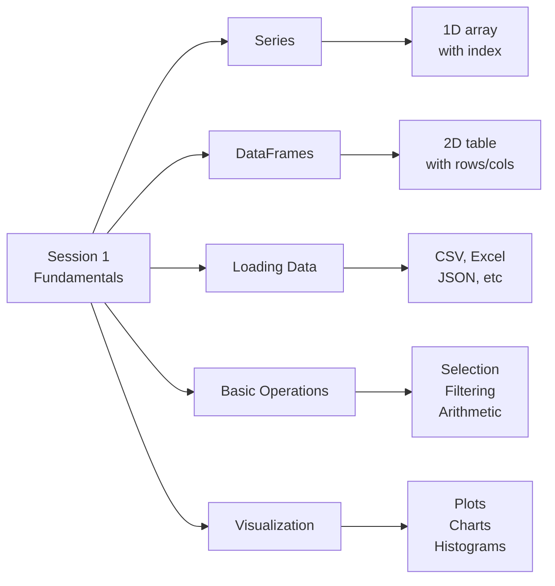
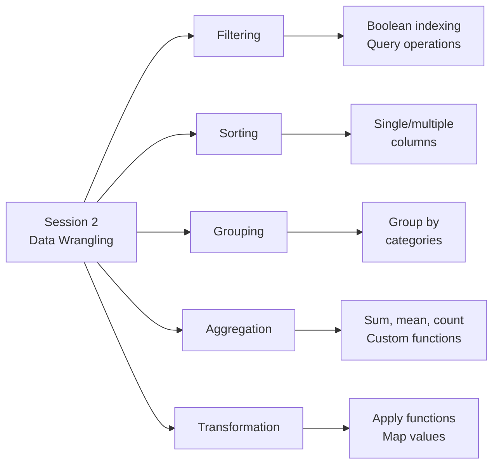
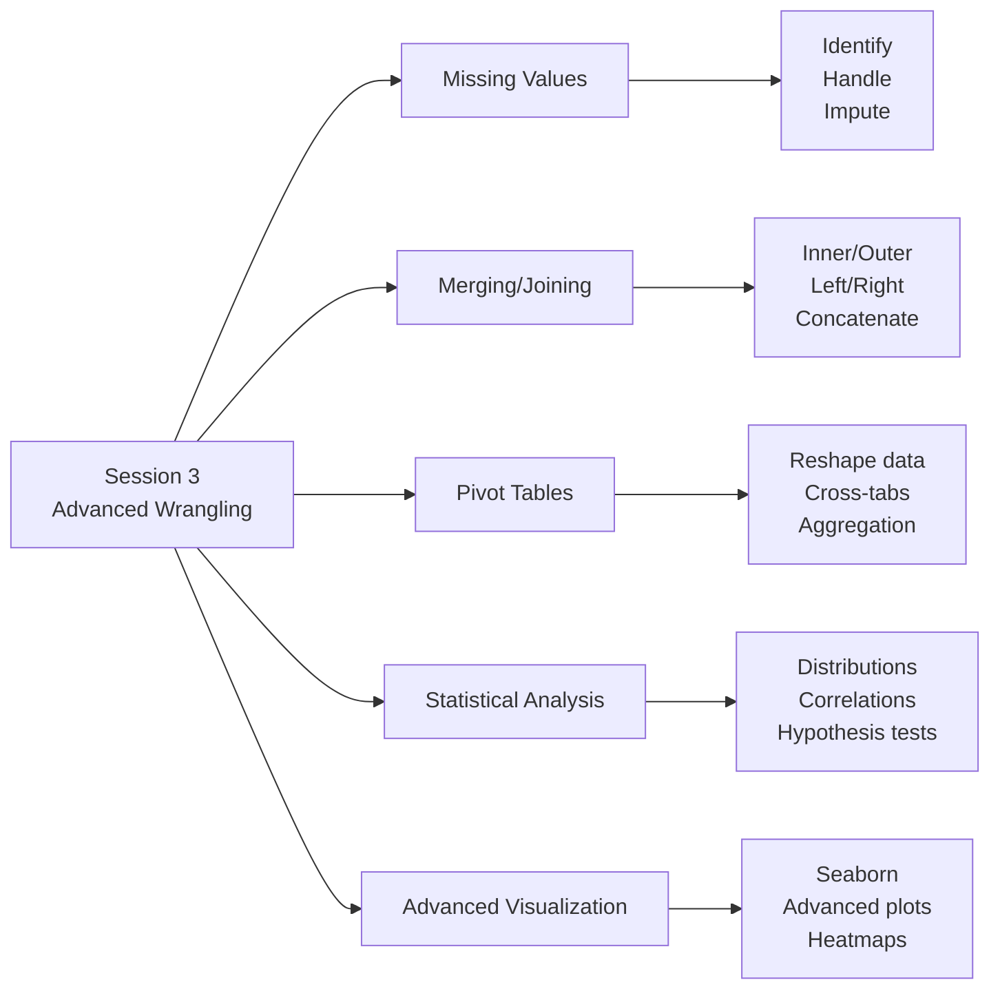
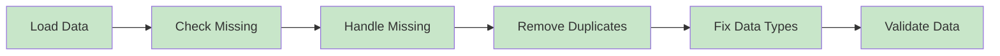
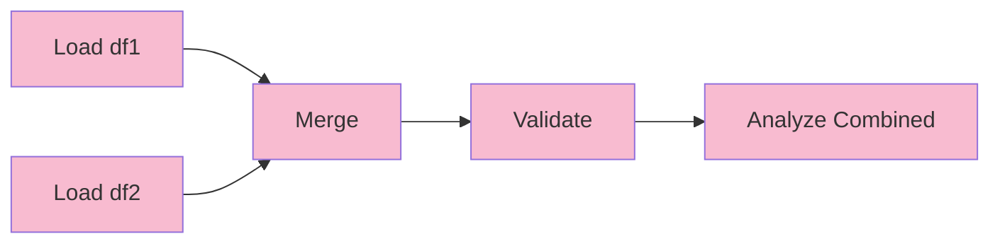

# Big Data Module (module-bd) - Complete Documentation

Welcome to the Big Data module documentation! This guide explains all code and data artifacts in the `module-bd` folder, designed for junior developers and students learning data processing with pandas and Python.

## 📚 Table of Contents

- [Overview](#overview)
- [Folder Structure](#folder-structure)
- [Jupyter Notebooks](#jupyter-notebooks)
- [Datasets](#datasets)
- [Utility Scripts](#utility-scripts)
- [Data Processing Workflows](#data-processing-workflows)
- [Learning Objectives](#learning-objectives)
- [Quick Start Guide](#quick-start-guide)

---

## Overview

The Big Data module teaches practical data processing skills using **pandas**, a powerful Python library for data manipulation and analysis. This module covers:

```mermaid
graph TB
    BigData["Big Data Module<br/>Data Processing with Pandas"]
    
    BigData --> Session1["Session 1<br/>Pandas Fundamentals"]
    BigData --> Session2["Session 2<br/>Data Wrangling"]
    BigData --> Session3["Session 3<br/>Advanced Wrangling"]
    
    Session1 --> Topics1["• Series & DataFrames<br/>• Loading data<br/>• Basic operations<br/>• Visualization"]
    Session2 --> Topics2["• Filtering & sorting<br/>• Grouping & aggregation<br/>• Data transformation<br/>• Correlation analysis"]
    Session3 --> Topics3["• Missing value handling<br/>• Data merging/joining<br/>• Pivot tables<br/>• Statistical analysis"]
    
    style BigData fill:#e8f5e9
    style Session1 fill:#c8e6c9
    style Session2 fill:#c8e6c9
    style Session3 fill:#c8e6c9
```



---

## Folder Structure

```
module-bd/
├── BigData-session-1.ipynb          # Pandas fundamentals
├── BigData-session-2.ipynb          # Data wrangling
├── BigData-session-3.ipynb          # Advanced wrangling
├── avatars.csv                      # Sample dataset (5 records)
├── fig/                             # Visualization images
│   ├── DataFrame.png                # DataFrame structure diagram
│   └── Series.png                   # Series structure diagram
├── sherlock/                        # Mobile app performance data
│   ├── app_info.csv                 # App metadata (54 apps)
│   ├── app_info_missing.csv         # App info with missing values
│   ├── sherlock_head2k.csv          # Performance metrics (2000 records)
│   ├── sherlock_mystery.csv         # Mystery dataset for analysis
│   └── sherlock_mystery_2apps.csv   # Subset for focused analysis
├── spam-ip/                         # Spam email IP analysis
│   ├── 1999.ip_alg1                 # 1999 spam IPs (algorithm 1)
│   ├── 1999.ip_alg2                 # 1999 spam IPs (algorithm 2)
│   └── 2003.ip_alg2                 # 2003 spam IPs (algorithm 2)
├── statistics/                      # Email statistics analysis
│   ├── Collect-email-sizes.sh       # Shell script to collect data
│   ├── Statistics-email-sizes.py    # Python statistics calculator
│   ├── email-sizes-1999.txt         # 1999 email sizes (1309 records)
│   ├── email-sizes-1999-50.txt      # 1999 sample (50 records)
│   └── email-sizes-2013.txt         # 2013 email sizes (1309 records)
├── network-intrusion/               # Network intrusion detection
│   └── README.txt                   # Dataset reference
└── .ipynb_checkpoints/              # Jupyter backup files
```

---

## Jupyter Notebooks

### 📓 BigData-session-1.ipynb - Pandas Fundamentals

**Duration:** 45-60 minutes  
**Difficulty:** Beginner  
**Prerequisites:** Python basics

#### Learning Objectives



#### Key Concepts Covered

1. **Series** - 1-dimensional labeled array
   ```python
   import pandas as pd
   s = pd.Series([1, 2, 3], index=['a', 'b', 'c'])
   ```

2. **DataFrames** - 2-dimensional table structure
   ```python
   df = pd.DataFrame({
       'Name': ['Alice', 'Bob'],
       'Age': [25, 30]
   })
   ```

3. **Loading Data**
   ```python
   df = pd.read_csv('avatars.csv')
   df = pd.read_excel('data.xlsx')
   df = pd.read_json('data.json')
   ```

4. **Basic Operations**
   - Selecting columns: `df['Name']` or `df.Name`
   - Selecting rows: `df.iloc[0]` or `df.loc['index']`
   - Arithmetic: `df['Age'] + 5`
   - Descriptive stats: `df.describe()`

5. **Visualization**
   ```python
   import matplotlib.pyplot as plt
   df.plot()
   df.hist()
   ```

#### Datasets Used

- **avatars.csv** - Simple dataset with 5 records
  - Columns: Name, Weight, Height
  - Purpose: Learning basic DataFrame operations

#### Exercises

- Create Series and DataFrames
- Load and explore CSV files
- Calculate statistics
- Create basic visualizations
- Filter and select data

---

### 📓 BigData-session-2.ipynb - Data Wrangling

**Duration:** 45-60 minutes  
**Difficulty:** Intermediate  
**Prerequisites:** Session 1 completion

#### Learning Objectives



#### Key Concepts Covered

1. **Filtering Data**
   ```python
   # Boolean indexing
   df[df['Age'] > 25]
   
   # Query method
   df.query('Age > 25')
   
   # isin() method
   df[df['Name'].isin(['Alice', 'Bob'])]
   ```

2. **Sorting Data**
   ```python
   df.sort_values('Age')
   df.sort_values(['Age', 'Name'], ascending=[True, False])
   ```

3. **Grouping and Aggregation**
   ```python
   df.groupby('Category')['Value'].sum()
   df.groupby('Category').agg({
       'Value': 'sum',
       'Count': 'mean'
   })
   ```

4. **Data Transformation**
   ```python
   df['NewColumn'] = df['Age'] * 2
   df['Category'] = df['Value'].apply(lambda x: 'High' if x > 50 else 'Low')
   ```

5. **Correlation Analysis**
   ```python
   df.corr()
   df.cov()
   ```

#### Datasets Used

- **sherlock_head2k.csv** - Mobile app performance data
  - 2000 records of app metrics
  - Columns: CPU_USAGE, Memory, Network, etc.
  - Purpose: Real-world data wrangling practice

#### Exercises

- Filter data by multiple conditions
- Sort by single and multiple columns
- Group data and calculate statistics
- Create new derived columns
- Analyze correlations
- Handle data transformations

---

### 📓 BigData-session-3.ipynb - Advanced Data Wrangling

**Duration:** 45-60 minutes  
**Difficulty:** Intermediate-Advanced  
**Prerequisites:** Sessions 1-2 completion

#### Learning Objectives



#### Key Concepts Covered

1. **Missing Value Handling**
   ```python
   # Identify missing values
   df.isnull()
   df.isnull().sum()
   
   # Handle missing values
   df.dropna()                    # Remove rows
   df.fillna(0)                   # Fill with value
   df.fillna(df.mean())           # Fill with mean
   df.interpolate()               # Interpolate
   ```

2. **Merging and Joining**
   ```python
   # Merge on common column
   pd.merge(df1, df2, on='key')
   
   # Join on index
   df1.join(df2)
   
   # Concatenate
   pd.concat([df1, df2])
   ```

3. **Pivot Tables**
   ```python
   df.pivot_table(
       values='Value',
       index='Category',
       columns='Type',
       aggfunc='sum'
   )
   ```

4. **Statistical Analysis**
   ```python
   df.describe()
   df.skew()
   df.kurtosis()
   df.cov()
   ```

5. **Advanced Visualization**
   ```python
   import seaborn as sns
   sns.heatmap(df.corr())
   sns.boxplot(data=df, x='Category', y='Value')
   sns.pairplot(df)
   ```

#### Datasets Used

- **app_info.csv** - App metadata (54 apps)
  - Columns: ApplicationName, Vendor, ApplicationType
  - Purpose: Merging with performance data

- **app_info_missing.csv** - App info with missing values
  - Purpose: Learning missing value handling

- **sherlock_mystery.csv** - Mystery dataset
  - Purpose: Advanced analysis and exploration

#### Exercises

- Identify and handle missing values
- Merge multiple datasets
- Create pivot tables
- Perform statistical analysis
- Create advanced visualizations
- Solve data mysteries

---

## Datasets

### 1. avatars.csv

**Purpose:** Simple introductory dataset  
**Size:** 5 records  
**Format:** CSV

**Structure:**
```
Name,Weight,Height
Apple,50,155
Berry,46,154
Coco,56,156
Dunkin,44,167
Eggplant,52,158
```

**Use Cases:**
- Learning basic DataFrame operations
- Understanding CSV loading
- Simple filtering and selection

---

### 2. sherlock/ - Mobile App Performance Data

**Purpose:** Real-world mobile app performance metrics  
**Source:** Sherlock dataset from mobile device monitoring

#### app_info.csv

**Size:** 54 records  
**Columns:** ApplicationName, Vendor, ApplicationType

**Sample:**
```
ApplicationName,Vendor,ApplicationType
Google App,Google,Search
Google Play services,Google,Services
System UI,Google,User Experience
Phone,Google,Phone
```

**Use Cases:**
- App metadata reference
- Joining with performance data
- Vendor analysis

#### app_info_missing.csv

**Size:** 54 records  
**Purpose:** Same as app_info.csv but with intentional missing values

**Use Cases:**
- Learning missing value handling
- Data imputation techniques
- Understanding data quality issues

#### sherlock_head2k.csv

**Size:** 2000 records  
**Columns:** 50+ performance metrics

**Key Columns:**
- UserId, UUID, ApplicationName
- CPU_USAGE, Memory metrics
- Network metrics (UidRxBytes, UidTxBytes, etc.)
- Process information (pid, ppid, priority)
- Resource usage (rss, vsize, threads)

**Sample Metrics:**
```
UserId: 97bb95f55a
ApplicationName: Gmail
CPU_USAGE: 0.13
Memory: 6931 PSS
Network RX: 0 bytes
Network TX: 0 bytes
```

**Use Cases:**
- Data wrangling practice
- Performance analysis
- Correlation studies
- Grouping and aggregation

#### sherlock_mystery.csv

**Size:** Full dataset  
**Purpose:** Mystery dataset for exploratory analysis

**Use Cases:**
- Advanced analysis exercises
- Data exploration challenges
- Real-world problem solving

#### sherlock_mystery_2apps.csv

**Size:** Subset (2 apps)  
**Purpose:** Focused analysis on specific applications

**Use Cases:**
- Comparative analysis
- Focused learning exercises
- Detailed investigation

---

### 3. spam-ip/ - Spam Email IP Analysis

**Purpose:** IP addresses associated with spam emails  
**Time Period:** 1999-2003

#### File Format

```
1999/01/915202605.14113.txt||Fail to get source IP|
1999/01/915202639.14137.txt||Fail to get source IP|
```

**Structure:**
- Email file path
- Separator: `||`
- IP extraction status/result

#### Files

| File | Records | Year | Algorithm |
|------|---------|------|-----------|
| 1999.ip_alg1 | 1309 | 1999 | Algorithm 1 |
| 1999.ip_alg2 | 1309 | 1999 | Algorithm 2 |
| 2003.ip_alg2 | 1309 | 2003 | Algorithm 2 |

**Use Cases:**
- Text parsing practice
- Data cleaning
- Temporal analysis
- Algorithm comparison

---

### 4. statistics/ - Email Size Statistics

**Purpose:** Email size distribution analysis  
**Time Period:** 1999, 2013

#### email-sizes-YYYY.txt

**Format:** One integer per line (email size in bytes)

**Sample:**
```
2304
2175
3318
4083
1677
```

**Files:**
- email-sizes-1999.txt (1309 records)
- email-sizes-1999-50.txt (50 records - sample)
- email-sizes-2013.txt (1309 records)

**Use Cases:**
- Statistical analysis
- Distribution comparison
- Time-series analysis
- Descriptive statistics

---

## Utility Scripts

### 1. Collect-email-sizes.sh

**Purpose:** Shell script to collect email file sizes from HPC storage

**Location:** `statistics/Collect-email-sizes.sh`

**Usage:**
```bash
./Collect-email-sizes.sh 1999
```

**What it does:**
```bash
#!/bin/bash
YEAR=$1
find /scratch-lustre/DeapSECURE/module01/spams/untroubled/"$YEAR"/[0-9][0-9] -type f \
    | xargs ls -l \
    | awk '{print $5}'
```

**Steps:**
1. Takes year as argument
2. Finds all email files in that year
3. Gets file sizes using `ls -l`
4. Extracts size column (5th field) using `awk`

**Output:** One file size per line (in bytes)

**Use Cases:**
- Data collection from HPC systems
- Batch processing
- Shell scripting practice

---

### 2. Statistics-email-sizes.py

**Purpose:** Calculate statistics from email size data

**Location:** `statistics/Statistics-email-sizes.py`

**Usage:**
```bash
python Statistics-email-sizes.py email-sizes-1999.txt
```

**Code:**
```python
import sys
import numpy

inputFile = sys.argv[1]
inputData = numpy.loadtxt(inputFile)

print("Number of emails      = {}".format(inputData.size))
print("Total email size      = {}".format(inputData.sum()))
print("Average email size    = {}".format(inputData.mean()))
print("Minimum email size    = {}".format(inputData.min()))
print("Maximum email size    = {}".format(inputData.max()))
```

**Output Example:**
```
Number of emails      = 1309
Total email size      = 3456789
Average email size    = 2641.5
Minimum email size    = 512
Maximum email size    = 15234
```

**Calculations:**
- Count: Total number of emails
- Sum: Total bytes across all emails
- Mean: Average email size
- Min: Smallest email
- Max: Largest email

**Use Cases:**
- Statistical analysis
- Data validation
- Cross-checking Spark results
- Python scripting practice

---

### 3. network-intrusion/README.txt

**Purpose:** Reference to network intrusion detection dataset

**Content:**
```
Network intrusion dataset
Name: CIC-IDS-2017
Location: /scratch-lustre/DeapSECURE/module02/CIC-IDS-2017/MachineLearningCVE
Description: https://www.unb.ca/cic/datasets/ids-2017.html
```

**Dataset Details:**
- **Name:** CIC-IDS-2017
- **Type:** Network intrusion detection
- **Source:** Canadian Institute for Cybersecurity
- **Purpose:** Machine learning for intrusion detection

**Use Cases:**
- Network security analysis
- Anomaly detection
- Classification tasks
- Large-scale data processing

---

## Data Processing Workflows

### Workflow 1: Basic Data Exploration


**Code Example:**
```python
import pandas as pd

# Load data
df = pd.read_csv('sherlock_head2k.csv')

# Inspect
print(df.shape)           # (2000, 50)
print(df.head())          # First 5 rows
print(df.tail())          # Last 5 rows
print(df.info())          # Column types
print(df.describe())      # Statistics
```

---

### Workflow 2: Data Cleaning



**Code Example:**
```python
# Check missing values
print(df.isnull().sum())

# Handle missing values
df = df.dropna()                    # Remove rows
df = df.fillna(df.mean())           # Fill with mean

# Remove duplicates
df = df.drop_duplicates()

# Fix data types
df['Age'] = df['Age'].astype(int)

# Validate
assert df.isnull().sum().sum() == 0
```

---

### Workflow 3: Data Analysis


**Code Example:**
```python
# Filter
high_cpu = df[df['CPU_USAGE'] > 0.5]

# Group and aggregate
by_app = df.groupby('ApplicationName').agg({
    'CPU_USAGE': 'mean',
    'Memory': 'max',
    'Network': 'sum'
})

# Analyze
print(by_app.describe())

# Visualize
by_app.plot(kind='bar')
```

---

### Workflow 4: Data Merging



**Code Example:**
```python
# Load datasets
apps = pd.read_csv('app_info.csv')
performance = pd.read_csv('sherlock_head2k.csv')

# Merge
merged = pd.merge(
    performance,
    apps,
    on='ApplicationName',
    how='left'
)

# Validate
print(merged.shape)
print(merged.isnull().sum())
```

---

## Learning Objectives

### By End of Session 1

```mermaid
graph TB
    A["Session 1 Objectives"]
    A --> B["✓ Create Series & DataFrames"]
    A --> C["✓ Load CSV files"]
    A --> D["✓ Select data by index/label"]
    A --> E["✓ Calculate basic statistics"]
    A --> F["✓ Create simple plots"]
```



**Skills:**
- [ ] Create pandas Series
- [ ] Create pandas DataFrames
- [ ] Load data from CSV
- [ ] Access data by position and label
- [ ] Calculate mean, median, std
- [ ] Create line and bar plots

---

### By End of Session 2

```mermaid
graph TB
    A["Session 2 Objectives"]
    A --> B["✓ Filter data with conditions"]
    A --> C["✓ Sort by columns"]
    A --> D["✓ Group and aggregate"]
    A --> E["✓ Create new columns"]
    A --> F["✓ Analyze correlations"]
```



**Skills:**
- [ ] Filter with boolean indexing
- [ ] Sort by single/multiple columns
- [ ] Use groupby() for aggregation
- [ ] Apply functions to columns
- [ ] Calculate correlations
- [ ] Create pivot tables

---

### By End of Session 3

```mermaid
graph TB
    A["Session 3 Objectives"]
    A --> B["✓ Handle missing values"]
    A --> C["✓ Merge datasets"]
    A --> D["✓ Create pivot tables"]
    A --> E["✓ Statistical analysis"]
    A --> F["✓ Advanced visualization"]
```



**Skills:**
- [ ] Identify missing values
- [ ] Impute missing data
- [ ] Merge/join datasets
- [ ] Create pivot tables
- [ ] Perform statistical tests
- [ ] Create heatmaps and advanced plots

---

## Quick Start Guide

### For Beginners

**Step 1: Set Up Environment**
```bash
pip install pandas numpy matplotlib seaborn jupyter
```

**Step 2: Start Jupyter**
```bash
jupyter notebook
```

**Step 3: Open Session 1**
- Navigate to `BigData-session-1.ipynb`
- Run cells sequentially
- Modify code and experiment

**Step 4: Practice with avatars.csv**
```python
import pandas as pd
df = pd.read_csv('avatars.csv')
print(df)
print(df.describe())
```

---

### For Intermediate Learners

**Step 1: Complete Session 1**
- Understand Series and DataFrames
- Practice loading and exploring data

**Step 2: Work with Real Data**
```python
df = pd.read_csv('sherlock/sherlock_head2k.csv')
df.groupby('ApplicationName')['CPU_USAGE'].mean()
```

**Step 3: Complete Session 2**
- Practice filtering and grouping
- Create aggregations
- Analyze correlations

---

### For Advanced Learners

**Step 1: Complete Sessions 1-2**

**Step 2: Work with Multiple Datasets**
```python
apps = pd.read_csv('sherlock/app_info.csv')
perf = pd.read_csv('sherlock/sherlock_head2k.csv')
merged = pd.merge(perf, apps, on='ApplicationName')
```

**Step 3: Complete Session 3**
- Handle missing values
- Perform statistical analysis
- Create advanced visualizations

**Step 4: Solve Data Mysteries**
- Analyze sherlock_mystery.csv
- Find patterns and insights
- Present findings

---

## Common Tasks and Solutions

### Task 1: Load and Explore Data

```python
import pandas as pd

# Load
df = pd.read_csv('data.csv')

# Explore
print(f"Shape: {df.shape}")
print(f"Columns: {df.columns.tolist()}")
print(df.head())
print(df.info())
print(df.describe())
```

---

### Task 2: Filter Data

```python
# Single condition
high_cpu = df[df['CPU_USAGE'] > 0.5]

# Multiple conditions
filtered = df[(df['CPU_USAGE'] > 0.5) & (df['Memory'] < 1000)]

# Using query
filtered = df.query('CPU_USAGE > 0.5 and Memory < 1000')

# Using isin
apps = df[df['ApplicationName'].isin(['Gmail', 'Chrome'])]
```

---

### Task 3: Group and Aggregate

```python
# Simple groupby
by_app = df.groupby('ApplicationName')['CPU_USAGE'].mean()

# Multiple aggregations
summary = df.groupby('ApplicationName').agg({
    'CPU_USAGE': ['mean', 'max', 'min'],
    'Memory': 'sum',
    'Network': 'count'
})

# Custom aggregation
custom = df.groupby('ApplicationName').apply(
    lambda x: x['CPU_USAGE'].max() - x['CPU_USAGE'].min()
)
```

---

### Task 4: Handle Missing Values

```python
# Check missing
print(df.isnull().sum())

# Remove rows with missing
df_clean = df.dropna()

# Fill with value
df['Column'] = df['Column'].fillna(0)

# Fill with mean
df['Column'] = df['Column'].fillna(df['Column'].mean())

# Forward fill
df['Column'] = df['Column'].fillna(method='ffill')
```

---

### Task 5: Merge Datasets

```python
# Merge on common column
merged = pd.merge(df1, df2, on='key')

# Merge on different columns
merged = pd.merge(df1, df2, left_on='key1', right_on='key2')

# Different join types
inner = pd.merge(df1, df2, how='inner')
left = pd.merge(df1, df2, how='left')
outer = pd.merge(df1, df2, how='outer')

# Concatenate
combined = pd.concat([df1, df2])
```

---

### Task 6: Create Visualizations

```python
import matplotlib.pyplot as plt
import seaborn as sns

# Line plot
df.plot(kind='line')

# Bar plot
df.groupby('Category')['Value'].sum().plot(kind='bar')

# Histogram
df['Column'].hist(bins=20)

# Scatter plot
df.plot.scatter(x='X', y='Y')

# Heatmap
sns.heatmap(df.corr())

# Box plot
sns.boxplot(data=df, x='Category', y='Value')
```

---

## Troubleshooting

### Issue: "FileNotFoundError: No such file or directory"

**Solution:**
```python
import os
print(os.getcwd())  # Check current directory
os.listdir()        # List files
# Make sure file path is correct
df = pd.read_csv('./sherlock/app_info.csv')
```

---

### Issue: "KeyError: 'ColumnName'"

**Solution:**
```python
# Check column names
print(df.columns)

# Use correct name
df['CPU_USAGE']  # Not df['cpu_usage']

# Handle spaces
df['Column Name']  # Use exact name with spaces
```

---

### Issue: "MemoryError" with large files

**Solution:**
```python
# Read in chunks
chunks = pd.read_csv('large_file.csv', chunksize=10000)
for chunk in chunks:
    process(chunk)

# Read specific columns
df = pd.read_csv('file.csv', usecols=['col1', 'col2'])

# Use data types
df = pd.read_csv('file.csv', dtype={'col': 'int32'})
```

---

### Issue: "NaN" values in calculations

**Solution:**
```python
# Check for NaN
print(df.isnull().sum())

# Remove NaN
df = df.dropna()

# Fill NaN
df = df.fillna(0)

# Use skipna parameter
df['Column'].mean(skipna=True)
```

---

## Resources

### Official Documentation
- [Pandas Documentation](https://pandas.pydata.org/docs/)
- [Matplotlib Documentation](https://matplotlib.org/stable/contents.html)
- [Seaborn Documentation](https://seaborn.pydata.org/)

### Tutorials
- [Pandas Getting Started](https://pandas.pydata.org/docs/getting_started/index.html)
- [Data Wrangling with Pandas](https://pandas.pydata.org/docs/user_guide/index.html)

### Cheat Sheets
- [Pandas Cheat Sheet](https://pandas.pydata.org/Pandas_Cheat_Sheet.pdf)
- [Matplotlib Cheat Sheet](https://matplotlib.org/cheatsheets/)

---

## Summary

The Big Data module teaches practical data processing skills through three progressive sessions:

1. **Session 1** - Learn pandas fundamentals with simple datasets
2. **Session 2** - Practice data wrangling with real-world data
3. **Session 3** - Master advanced techniques and analysis

**Key Datasets:**
- avatars.csv - Simple learning data
- sherlock/ - Real mobile app performance data
- spam-ip/ - Email spam analysis data
- statistics/ - Email size statistics

**Key Skills:**
- Loading and exploring data
- Filtering and sorting
- Grouping and aggregation
- Handling missing values
- Merging datasets
- Statistical analysis
- Data visualization

**Next Steps:**
1. Complete all three sessions
2. Practice with provided datasets
3. Solve data mysteries
4. Apply skills to your own data

---

**Happy Data Wrangling! 📊**

For questions or issues, refer to the official pandas documentation or ask your instructor.

Last Updated: December 2024
