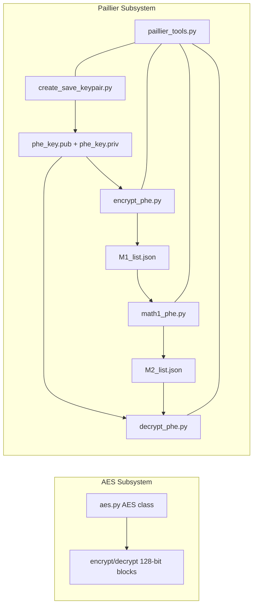

# Project Design Document: module-crypt

## 1. Overview

`module-crypt` is a training repository for two cryptography tracks:

- Symmetric cryptography using a pure-Python AES-128 implementation.
- Partially homomorphic encryption (Paillier) using `python-paillier` (`phe`).

The repository is designed for workshops and notebooks, with script-based demos for repeatable command-line exercises.

## 2. Goals and Non-Goals

### Goals

- Provide clear, inspectable cryptography examples for instruction.
- Demonstrate end-to-end Paillier workflows: key generation, encryption, homomorphic computation, decryption.
- Provide serialization helpers for key material and encrypted values.

### Non-Goals

- Production-grade cryptography hardening.
- Full protocol design (key exchange, authentication, secure transport).
- High-performance implementations.

## 3. Repository Structure

- `aes.py`: Main AES implementation (`AES` class).
- `AES/aes.py`: Duplicate of `aes.py` (currently identical).
- `paillier_tools.py`: Core serialization and utility helpers.
- `Paillier/`: Script demos and duplicated `paillier_tools.py`.
- `Crypt-session-1.ipynb`: AES workshop notebook.
- `Crypt-session-2.ipynb`: Additional crypto exercises.
- `Crypt-session-3.ipynb`: Paillier workshop notebook.
- `fig/`: Notebook images and teaching assets.

## 4. Architecture

The project has two mostly independent subsystems:

1. AES subsystem (pure Python, local computation only).
2. Paillier subsystem (depends on `phe`, with file-based message passing between scripts).



## 5. Component Design

### 5.1 AES Component

Primary file: `aes.py`

- Implements AES round operations manually (`SubBytes`, `ShiftRows`, `MixColumns`, inverse operations).
- Uses constant S-box/InvS-box and Rcon tables.
- Public API:
  - `AES(master_key)`
  - `encrypt(plaintext_int) -> ciphertext_int`
  - `decrypt(ciphertext_int) -> plaintext_int`

Data model:

- Block/key representation is integer-based 128-bit values.
- Internal state uses 4x4 byte matrices (`text2matrix`, `matrix2text`).

Design implication:

- Suitable for pedagogy and algorithm tracing.
- Not intended to replace hardened libraries such as OpenSSL/`cryptography`.

### 5.2 Paillier Utility Layer

Primary files: `paillier_tools.py`, `Paillier/paillier_tools.py` (duplicate)

Responsibilities:

- Key serialization/deserialization in JWK-like JSON:
  - `keypair_dump_jwk`, `keypair_load_jwk`
  - `pubkey_load_jwk`, `privkey_load_jwk`
- Encrypted vector serialization:
  - `envec_dump_json`, `envec_load_json`
- Encrypted image metadata format:
  - `enimg_dump_json`, `enimg_load_json`, `validate_array2d`
- File helpers:
  - `read_file`, `write_file`

Data format choices:

- Public/private key values and ciphertexts are base64-encoded big integers (`phe.util.int_to_base64`).
- Encrypted vectors are serialized with:
  - Public modulus `n`
  - Per-value `(ciphertext, exponent)` tuples

### 5.3 Paillier Script Pipeline

Primary files: `Paillier/create_save_keypair.py`, `Paillier/encrypt_phe.py`, `Paillier/math1_phe.py`, `Paillier/decrypt_phe.py`

- `create_save_keypair.py`
  - Generates a 2048-bit keypair.
  - Writes `phe_key.pub`.
  - Writes `phe_key.priv` with mode `0600` via low-level `os.open` to enforce private-key permissions.
- `encrypt_phe.py`
  - Loads public key from `phe_key.pub`.
  - Encrypts sample plaintext list.
  - Writes ciphertext list to `M1_list.json`.
- `math1_phe.py`
  - Loads encrypted list from `M1_list.json`.
  - Performs homomorphic scalar multiplication (`* 2.0`).
  - Writes `M2_list.json`.
- `decrypt_phe.py`
  - Loads keypair and `M2_list.json`.
  - Decrypts and prints results.

## 6. Data Contracts

### 6.1 Key Files

- `phe_key.pub`: JWK-like JSON public key record (`kty`, `alg`, `n`, metadata).
- `phe_key.priv`: JWK-like JSON private key record (`kty`, `p`, `q`, metadata).

### 6.2 Encrypted Vector Files

- `M1_list.json`, `M2_list.json`:
  - `public_key.n` (base64 integer)
  - `values`: array of `(ciphertext_base64, exponent)` entries

Constraint:

- Script execution is directory-sensitive due to relative paths; run from `Paillier/` for pipeline scripts.

## 7. Operational Workflow

### 7.1 Setup

- Python 3 environment with required libraries (`phe`, `numpy`, notebook dependencies from README).

### 7.2 Paillier Demo Execution

```bash
cd Paillier
python3 create_save_keypair.py
python3 encrypt_phe.py
python3 math1_phe.py
python3 decrypt_phe.py
```

Expected outputs:

- `phe_key.pub`, `phe_key.priv`, `M1_list.json`, `M2_list.json`
- Decrypted transformed values printed to stdout.

## 8. Security and Trust Boundaries

Security posture is educational.

- Positive:
  - Private key file creation in `create_save_keypair.py` enforces owner-only mode.
  - Separation of roles is demonstrated across scripts.
- Risks:
  - Demo key files are committed in `Paillier/` and must not be reused for real systems.
  - JSON inputs are only lightly validated.
  - No authenticity/integrity checks (signatures/MACs) for key or ciphertext files.
  - Duplicate source files increase drift risk (`aes.py`, `paillier_tools.py` copies).

## 9. Testing Strategy

Current state:

- No formal automated test suite in repository.

Recommended minimal tests:

- AES known-answer tests (NIST vectors) for `encrypt` and `decrypt`.
- Round-trip tests for:
  - `keypair_dump_jwk` + `keypair_load_jwk`
  - `envec_dump_json` + `envec_load_json`
- Pipeline smoke test validating artifact creation and decrypted values.
- File permission assertion test for `phe_key.priv` mode `0600`.

## 10. Maintainability Notes

- Consolidate duplicate modules:
  - Keep one canonical `aes.py`.
  - Keep one canonical `paillier_tools.py`.
  - Import shared code rather than copying.
- Add project-level `requirements.txt` or `pyproject.toml` for reproducible setup.
- Consider `argparse` for scripts to support configurable paths and input data.

## 11. Future Enhancements

- Add CI checks (lint + tests + notebook smoke execution).
- Add signed artifact support (or authenticated transport) for serialized ciphertext files.
- Expand examples:
  - Homomorphic aggregation over datasets.
  - Encrypted image processing workflow using `enimg_*` utilities.
- Add benchmark scripts to compare plaintext vs encrypted compute costs.

