# Cryptography Module (module-crypt) - Complete Documentation

Welcome to the Cryptography module documentation! This guide explains all code and data artifacts in the `module-crypt` folder, designed for junior developers and students learning cryptography with Python.

## 📚 Table of Contents

- [Overview](#overview)
- [Folder Structure](#folder-structure)
- [Jupyter Notebooks](#jupyter-notebooks)
- [Python Scripts](#python-scripts)
- [Learning Paths](#learning-paths)
- [Quick Start Guide](#quick-start-guide)
- [Common Tasks](#common-tasks)
- [Troubleshooting](#troubleshooting)
- [Resources](#resources)

---

## Overview

The Cryptography module teaches cryptographic fundamentals using **Python**, covering data encoding, symmetric encryption (AES), and homomorphic encryption (Paillier). This module covers:

```mermaid
graph TB
    CRYPT["Cryptography Module<br/>Encryption & Data Security"]
    
    CRYPT --> Session1["Session 1<br/>Data Encoding"]
    CRYPT --> Session2["Session 2<br/>AES Encryption"]
    CRYPT --> Session3["Session 3<br/>Homomorphic Encryption"]
    
    Session1 --> Topics1["• Binary representation<br/>• Hexadecimal encoding<br/>• UTF-8 encoding<br/>• Padding schemes"]
    Session2 --> Topics2["• AES algorithm<br/>• Encryption/Decryption<br/>• Key management<br/>• Performance analysis"]
    Session3 --> Topics3["• Paillier cryptosystem<br/>• Homomorphic arithmetic<br/>• Privacy-preserving<br/>• Applications"]
    
    style CRYPT fill:#f3e5f5
    style Session1 fill:#e1bee7
    style Session2 fill:#e1bee7
    style Session3 fill:#e1bee7
```



---

## Folder Structure

```
module-crypt/
├── Crypt-session-1.ipynb                 # Data encoding
├── Crypt-session-2.ipynb                 # AES encryption
├── Crypt-session-3.ipynb                 # Homomorphic encryption
├── aes.py                                # AES utilities
├── paillier_tools.py                     # Paillier utilities
├── crypto-env-py3                        # Environment file
├── AES/                                  # AES examples
│   └── aes.py                            # AES implementation
├── Paillier/                             # Paillier examples
│   ├── basic_enc.py                      # Basic encryption
│   ├── create_save_keypair.py            # Key generation
│   ├── decrypt_phe.py                    # Decryption
│   ├── encrypt_phe.py                    # Encryption
│   ├── math1_phe.py                      # Math operations
│   ├── paillier_tools.py                 # Utilities
│   ├── sum_floats_phe.py                 # Float summation
│   ├── sum_ints_phe.py                   # Integer summation
│   ├── phe_key.pub                       # Public key
│   ├── phe_key.priv                      # Private key
│   └── King-Oofy.pub                     # Example public key
├── fig/                                  # Figures
│   ├── 500px-ASCII_Code_Chart.png        # ASCII reference
│   └── Tux_ecb.jpg                       # ECB mode diagram
├── images/                               # Documentation images
│   └── (empty - for diagrams)
└── phe_image/                            # Docker images
    └── (empty - for container setup)
```

---

## Jupyter Notebooks

### 📓 Crypt-session-1.ipynb - Data Encoding and Representation

**Duration:** 45-60 minutes  
**Difficulty:** Beginner  
**Prerequisites:** Basic Python knowledge

#### Learning Objectives


#### Key Concepts

1. **Binary Representation**
   - Bits and bytes
   - Binary conversion
   - Bit operations
   - Binary arithmetic

2. **Hexadecimal Encoding**
   - Hex notation
   - Hex conversion
   - Hex representation
   - Hex arithmetic

3. **UTF-8 Encoding**
   - Character encoding
   - Unicode
   - Multi-byte characters
   - Encoding/decoding

4. **Padding Schemes**
   - PKCS7 padding
   - Block alignment
   - Padding validation
   - Unpadding

#### Topics Covered

1. **Binary Conversion**
   ```python
   # String to binary
   text = "Hello"
   binary = ''.join(format(ord(c), '08b') for c in text)
   
   # Binary to string
   text = ''.join(chr(int(binary[i:i+8], 2)) for i in range(0, len(binary), 8))
   ```

2. **Hexadecimal Encoding**
   ```python
   # String to hex
   text = "Hello"
   hex_str = text.encode().hex()
   
   # Hex to string
   text = bytes.fromhex(hex_str).decode()
   ```

3. **UTF-8 Encoding**
   ```python
   # String to UTF-8
   text = "Hello 世界"
   utf8_bytes = text.encode('utf-8')
   
   # UTF-8 to string
   text = utf8_bytes.decode('utf-8')
   ```

4. **PKCS7 Padding**
   ```python
   def pad(data, block_size=16):
       padding_len = block_size - (len(data) % block_size)
       return data + bytes([padding_len] * padding_len)
   
   def unpad(data):
       padding_len = data[-1]
       return data[:-padding_len]
   ```

#### Exercises

- Convert between binary, hex, and text
- Encode/decode UTF-8
- Implement padding schemes
- Validate padding
- Work with byte arrays

---

### 📓 Crypt-session-2.ipynb - AES Encryption

**Duration:** 60-90 minutes  
**Difficulty:** Intermediate  
**Prerequisites:** Session 1 completion

#### Learning Objectives


#### Key Concepts

1. **AES Algorithm**
   - Advanced Encryption Standard
   - Key sizes (128, 192, 256 bits)
   - Block size (128 bits)
   - Rounds (10, 12, 14)

2. **Encryption Modes**
   - ECB (Electronic Codebook)
   - CBC (Cipher Block Chaining)
   - CTR (Counter)
   - GCM (Galois/Counter Mode)

3. **Key Management**
   - Key generation
   - Key storage
   - Key derivation
   - Key rotation

4. **Performance Analysis**
   - Encryption speed
   - Decryption speed
   - Memory usage
   - Optimization techniques

#### Topics Covered

1. **Basic AES Encryption**
   ```python
   from Crypto.Cipher import AES
   from Crypto.Random import get_random_bytes
   
   # Generate key
   key = get_random_bytes(16)  # 128-bit key
   
   # Create cipher
   cipher = AES.new(key, AES.MODE_EAX)
   
   # Encrypt
   plaintext = b"Hello, World!"
   ciphertext, tag = cipher.encrypt_and_digest(plaintext)
   ```

2. **AES Decryption**
   ```python
   # Create cipher for decryption
   cipher = AES.new(key, AES.MODE_EAX, nonce=cipher.nonce)
   
   # Decrypt
   plaintext = cipher.decrypt_and_verify(ciphertext, tag)
   ```

3. **Performance Measurement**
   ```python
   import time
   
   start = time.time()
   ciphertext, tag = cipher.encrypt_and_digest(plaintext)
   end = time.time()
   
   elapsed = end - start
   throughput = len(plaintext) / elapsed / 1e6  # MB/s
   ```

#### Exercises

- Generate AES keys
- Encrypt data
- Decrypt data
- Compare encryption modes
- Measure performance
- Implement key derivation

---

### 📓 Crypt-session-3.ipynb - Homomorphic Encryption (Paillier)

**Duration:** 60-90 minutes  
**Difficulty:** Intermediate-Advanced  
**Prerequisites:** Sessions 1-2 completion

#### Learning Objectives


#### Key Concepts

1. **Paillier Cryptosystem**
   - Additive homomorphic encryption
   - Semantic security
   - Probabilistic encryption
   - Threshold cryptography

2. **Keypair Generation**
   - Prime number generation
   - Modulus computation
   - Public key
   - Private key

3. **Homomorphic Arithmetic**
   - Encrypted addition
   - Encrypted multiplication by scalar
   - Decryption
   - Correctness verification

4. **Privacy-Preserving Applications**
   - Secure voting
   - Privacy-preserving analytics
   - Secure multi-party computation
   - Data aggregation

#### Topics Covered

1. **Paillier Keypair Generation**
   ```python
   from phe import paillier
   
   # Generate keypair
   public_key, private_key = paillier.generate_paillier_keypair(
       n_length=2048
   )
   ```

2. **Encryption and Decryption**
   ```python
   # Encrypt
   plaintext = 42
   encrypted = public_key.encrypt(plaintext)
   
   # Decrypt
   decrypted = private_key.decrypt(encrypted)
   ```

3. **Homomorphic Addition**
   ```python
   # Encrypted + Encrypted
   result = encrypted1 + encrypted2
   decrypted_result = private_key.decrypt(result)
   
   # Encrypted + Plaintext
   result = encrypted + 10
   decrypted_result = private_key.decrypt(result)
   ```

4. **Homomorphic Multiplication**
   ```python
   # Encrypted * Plaintext (scalar)
   result = encrypted * 5
   decrypted_result = private_key.decrypt(result)
   ```

#### Exercises

- Generate Paillier keypairs
- Encrypt/decrypt data
- Perform homomorphic addition
- Perform homomorphic multiplication
- Implement privacy-preserving sum
- Analyze security properties

---

## Python Scripts

### 🐍 aes.py - AES Utilities

**Location:** `aes.py` and `AES/aes.py`

**Purpose:** AES encryption/decryption utilities

**Key Functions:**

```python
generate_key(key_size=16)
    # Generate random AES key
    
encrypt_aes(plaintext, key)
    # Encrypt data with AES
    
decrypt_aes(ciphertext, key, nonce, tag)
    # Decrypt data with AES
    
measure_performance(data_size, iterations=100)
    # Measure encryption performance
```

**Usage Example:**

```python
from aes import generate_key, encrypt_aes, decrypt_aes

# Generate key
key = generate_key(16)  # 128-bit

# Encrypt
plaintext = b"Secret message"
ciphertext, nonce, tag = encrypt_aes(plaintext, key)

# Decrypt
decrypted = decrypt_aes(ciphertext, key, nonce, tag)
```

---

### 🐍 paillier_tools.py - Paillier Utilities

**Location:** `paillier_tools.py` and `Paillier/paillier_tools.py`

**Purpose:** Paillier homomorphic encryption utilities

**Key Functions:**

```python
generate_keypair(n_length=2048)
    # Generate Paillier keypair
    
encrypt_value(public_key, plaintext)
    # Encrypt value
    
decrypt_value(private_key, ciphertext)
    # Decrypt value
    
secure_sum(public_key, values)
    # Compute sum on encrypted values
    
save_keypair(public_key, private_key, prefix)
    # Save keys to files
    
load_keypair(prefix)
    # Load keys from files
```

**Usage Example:**

```python
from paillier_tools import generate_keypair, encrypt_value, decrypt_value

# Generate keypair
pub, priv = generate_keypair(2048)

# Encrypt
encrypted = encrypt_value(pub, 42)

# Decrypt
decrypted = decrypt_value(priv, encrypted)
```

---

### 🐍 Paillier Scripts

#### basic_enc.py - Basic Encryption

**Purpose:** Simple Paillier encryption example

#### create_save_keypair.py - Keypair Generation

**Purpose:** Generate and save Paillier keypairs

```bash
python Paillier/create_save_keypair.py
```

#### encrypt_phe.py - Encryption

**Purpose:** Encrypt data with Paillier

#### decrypt_phe.py - Decryption

**Purpose:** Decrypt Paillier ciphertext

#### math1_phe.py - Homomorphic Arithmetic

**Purpose:** Perform arithmetic on encrypted data

#### sum_ints_phe.py - Integer Summation

**Purpose:** Sum encrypted integers

#### sum_floats_phe.py - Float Summation

**Purpose:** Sum encrypted floating-point numbers

---

## Cryptographic Concepts

### Concept 1: Symmetric Encryption (AES)


**Characteristics:**
- Same key for encryption and decryption
- Fast and efficient
- Requires secure key distribution
- Block cipher (128-bit blocks)

---

### Concept 2: Homomorphic Encryption (Paillier)


**Characteristics:**
- Additive homomorphic property
- Allows computation on encrypted data
- Slower than symmetric encryption
- Privacy-preserving applications

---

## Learning Paths

### Path 1: Data Encoding (1-2 hours)


**Outcomes:**
- Understand binary, hex, UTF-8
- Implement padding schemes
- Work with byte arrays

---

### Path 2: AES Encryption (2-3 hours)


**Outcomes:**
- Understand AES algorithm
- Encrypt/decrypt data
- Manage keys
- Measure performance

---

### Path 3: Homomorphic Encryption (3-4 hours)


**Outcomes:**
- Understand Paillier cryptosystem
- Perform homomorphic arithmetic
- Implement privacy-preserving applications
- Analyze security properties

---

## Quick Start Guide

### For Beginners

**Step 1: Install Dependencies**
```bash
pip install pycryptodome python-phe
```

**Step 2: Start Jupyter**
```bash
jupyter notebook
```

**Step 3: Open Session 1**
- Navigate to `Crypt-session-1.ipynb`
- Run cells sequentially
- Understand data encoding

**Step 4: Practice Encoding**
```python
# Binary
text = "Hello"
binary = ''.join(format(ord(c), '08b') for c in text)

# Hex
hex_str = text.encode().hex()

# UTF-8
utf8_bytes = text.encode('utf-8')
```

---

### For Intermediate Learners

**Step 1: Complete Session 1**
- Understand encoding schemes
- Practice conversions

**Step 2: Complete Session 2**
- Learn AES encryption
- Encrypt/decrypt data

**Step 3: Run AES Examples**
```bash
python AES/aes.py
```

**Step 4: Measure Performance**
```python
from aes import measure_performance
measure_performance(1024)  # 1KB data
```

---

### For Advanced Learners

**Step 1: Complete Sessions 1-2**

**Step 2: Complete Session 3**
- Learn Paillier cryptosystem
- Perform homomorphic arithmetic

**Step 3: Generate Paillier Keys**
```bash
python Paillier/create_save_keypair.py
```

**Step 4: Implement Privacy-Preserving Sum**
```python
from paillier_tools import generate_keypair, encrypt_value, decrypt_value

pub, priv = generate_keypair(2048)

# Encrypt values
values = [10, 20, 30, 40, 50]
encrypted = [encrypt_value(pub, v) for v in values]

# Sum encrypted values
encrypted_sum = sum(encrypted)

# Decrypt result
result = decrypt_value(priv, encrypted_sum)
print(f"Sum: {result}")  # 150
```

---

## Common Tasks and Solutions

### Task 1: Binary Conversion

```python
# String to binary
text = "Hello"
binary = ''.join(format(ord(c), '08b') for c in text)
print(binary)

# Binary to string
text = ''.join(chr(int(binary[i:i+8], 2)) for i in range(0, len(binary), 8))
print(text)
```

---

### Task 2: Hexadecimal Encoding

```python
# String to hex
text = "Hello"
hex_str = text.encode().hex()
print(hex_str)

# Hex to string
text = bytes.fromhex(hex_str).decode()
print(text)
```

---

### Task 3: UTF-8 Encoding

```python
# String to UTF-8
text = "Hello 世界"
utf8_bytes = text.encode('utf-8')
print(utf8_bytes)

# UTF-8 to string
text = utf8_bytes.decode('utf-8')
print(text)
```

---

### Task 4: PKCS7 Padding

```python
def pad(data, block_size=16):
    padding_len = block_size - (len(data) % block_size)
    return data + bytes([padding_len] * padding_len)

def unpad(data):
    padding_len = data[-1]
    return data[:-padding_len]

# Test
data = b"Hello"
padded = pad(data)
unpadded = unpad(padded)
print(unpadded)
```

---

### Task 5: AES Encryption

```python
from Crypto.Cipher import AES
from Crypto.Random import get_random_bytes

# Generate key
key = get_random_bytes(16)

# Create cipher
cipher = AES.new(key, AES.MODE_EAX)

# Encrypt
plaintext = b"Secret message"
ciphertext, tag = cipher.encrypt_and_digest(plaintext)

# Decrypt
cipher = AES.new(key, AES.MODE_EAX, nonce=cipher.nonce)
decrypted = cipher.decrypt_and_verify(ciphertext, tag)
print(decrypted)
```

---

### Task 6: Paillier Encryption

```python
from phe import paillier

# Generate keypair
pub, priv = paillier.generate_paillier_keypair(n_length=2048)

# Encrypt
plaintext = 42
encrypted = pub.encrypt(plaintext)

# Decrypt
decrypted = priv.decrypt(encrypted)
print(decrypted)
```

---

### Task 7: Homomorphic Addition

```python
from phe import paillier

pub, priv = paillier.generate_paillier_keypair(n_length=2048)

# Encrypt values
a = pub.encrypt(10)
b = pub.encrypt(20)

# Add encrypted values
result = a + b

# Decrypt result
decrypted = priv.decrypt(result)
print(decrypted)  # 30
```

---

## Troubleshooting

### Issue: "ModuleNotFoundError: No module named 'Crypto'"

**Solution:**
```bash
pip install pycryptodome
```

---

### Issue: "ModuleNotFoundError: No module named 'phe'"

**Solution:**
```bash
pip install python-phe
```

---

### Issue: "Padding is incorrect"

**Solution:**
Ensure block size matches:
```python
# Correct
padded = pad(data, block_size=16)
unpadded = unpad(padded)

# Wrong
padded = pad(data, block_size=8)
unpadded = unpad(padded)  # May fail
```

---

### Issue: "Decryption fails"

**Solution:**
- Verify key is correct
- Check ciphertext integrity
- Ensure tag matches (for authenticated encryption)

```python
# Correct
cipher = AES.new(key, AES.MODE_EAX, nonce=cipher.nonce)
decrypted = cipher.decrypt_and_verify(ciphertext, tag)

# Wrong - using different key
cipher = AES.new(wrong_key, AES.MODE_EAX, nonce=cipher.nonce)
decrypted = cipher.decrypt_and_verify(ciphertext, tag)  # Fails
```

---

### Issue: "Paillier encryption is slow"

**Solution:**
- Use smaller key size for testing (1024 bits)
- Use parallel processing for multiple encryptions
- Cache public key

```python
# Faster for testing
pub, priv = paillier.generate_paillier_keypair(n_length=1024)

# Production
pub, priv = paillier.generate_paillier_keypair(n_length=2048)
```

---

## Security Considerations

### 1. Key Management

- Store keys securely
- Use key derivation functions
- Rotate keys regularly
- Never hardcode keys

```python
# Wrong
key = b"my_secret_key_123"

# Correct
from Crypto.Protocol.KDF import PBKDF2
password = "strong_password"
key = PBKDF2(password, salt, dkLen=16)
```

---

### 2. Random Number Generation

- Use cryptographically secure RNG
- Never use `random` module
- Use `os.urandom()` or `Crypto.Random`

```python
# Wrong
import random
key = random.randbytes(16)

# Correct
from Crypto.Random import get_random_bytes
key = get_random_bytes(16)
```

---

### 3. Authenticated Encryption

- Use authenticated encryption modes (GCM, EAX)
- Verify authentication tags
- Detect tampering

```python
# Correct - authenticated
cipher = AES.new(key, AES.MODE_EAX)
ciphertext, tag = cipher.encrypt_and_digest(plaintext)

# Decrypt with verification
cipher = AES.new(key, AES.MODE_EAX, nonce=cipher.nonce)
plaintext = cipher.decrypt_and_verify(ciphertext, tag)
```

---

## Resources

### Official Documentation
- [PyCryptodome](https://pycryptodome.readthedocs.io/)
- [python-phe](https://python-phe.readthedocs.io/)
- [NIST AES](https://nvlpubs.nist.gov/nistpubs/FIPS/NIST.FIPS.197.pdf)

### Tutorials
- [Cryptography Basics](https://cryptography.io/)
- [AES Explained](https://en.wikipedia.org/wiki/Advanced_Encryption_Standard)
- [Paillier Cryptosystem](https://en.wikipedia.org/wiki/Paillier_cryptosystem)

### Books
- "Cryptography Engineering" by Ferguson, Schneier, Kohno
- "Understanding Cryptography" by Paar, Pelzl

### Online Resources
- [Crypto101](https://www.crypto101.io/)
- [Cryptopals Challenges](https://cryptopals.com/)

---

## Summary

The Cryptography module teaches cryptographic fundamentals through:

1. **Session 1** - Data encoding and representation
2. **Session 2** - AES symmetric encryption
3. **Session 3** - Paillier homomorphic encryption
4. **Python Scripts** - Practical implementations

**Key Skills:**
- Data encoding (binary, hex, UTF-8)
- Symmetric encryption (AES)
- Homomorphic encryption (Paillier)
- Key management
- Security best practices
- Privacy-preserving applications

**Next Steps:**
1. Complete all three sessions
2. Run Python examples
3. Implement custom applications
4. Explore advanced topics
5. Apply to real-world scenarios

---

**Happy Cryptography! 🔐**

For questions or issues, refer to official documentation or ask your instructor.

Last Updated: December 2024
