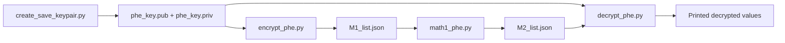
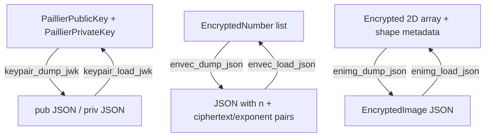

# module-crypt

Training repository for symmetric cryptography (AES) and partially homomorphic encryption (Paillier).

## What is in this repo

- `Crypt-session-1.ipynb`: AES-focused notebook content.
- `Crypt-session-2.ipynb`: additional cryptography exercises.
- `Crypt-session-3.ipynb`: Paillier + `paillier_tools` workshop content.
- `aes.py` and `AES/aes.py`: pure-Python AES implementation (`AES` class).
- `paillier_tools.py`: helper utilities for Paillier key/data serialization.
- `Paillier/`: script-based Paillier demos and sample key files.
- `fig/`: images used by notebooks/materials.

## Prerequisites

Use Python 3 and install the core libraries used by scripts/notebooks:

```bash
python3 -m venv .venv
source .venv/bin/activate
pip install phe numpy scipy pandas matplotlib ipython mpi4py gmpy2
```

Notes:
- `crypto-env-py3` is an HPC module-load script from the original training environment.
- For local development, `pip` installation is usually simpler.

## Quickstart (Paillier script pipeline)

The 3-script flow in `Paillier/` expects relative paths, so run from inside that directory:

```bash
cd Paillier
python3 create_save_keypair.py
python3 encrypt_phe.py
python3 math1_phe.py
python3 decrypt_phe.py
```

Expected artifact files:
- `phe_key.pub`, `phe_key.priv` from key generation.
- `M1_list.json` from encryption.
- `M2_list.json` from homomorphic operations.

## Workflow diagram



## Data format overview (`paillier_tools`)

`paillier_tools.py` provides JSON/JWK-style serialization utilities used by the scripts and notebook:

- Key helpers: `keypair_dump_jwk`, `keypair_load_jwk`, `pubkey_load_jwk`, `privkey_load_jwk`
- Encrypted vector helpers: `envec_dump_json`, `envec_load_json`
- Encrypted 2D image helpers: `enimg_dump_json`, `enimg_load_json`, `validate_array2d`
- File helpers: `read_file`, `write_file`



## AES usage

`aes.py` exposes an `AES` class for 128-bit block encrypt/decrypt using integer plaintext/ciphertext blocks:

```python
from aes import AES

key = 0x2b7e151628aed2a6abf7158809cf4f3c
pt  = 0x3243f6a8885a308d313198a2e0370734

cipher = AES(key)
ct = cipher.encrypt(pt)
rt = cipher.decrypt(ct)
print(hex(ct), hex(rt))
```

## Notes

- There are two copies of `paillier_tools.py` (repo root and `Paillier/`), with matching functionality.
- The sample files in `Paillier/` include pre-generated keys intended for demo/training use.
- Do not use demo keys in real systems.
