# Neural Networks Module (module-nn) - Complete Documentation

Welcome to the Neural Networks module documentation! This guide explains all code and data artifacts in the `module-nn` folder, designed for junior developers and students learning deep learning with Keras and TensorFlow.

## 📚 Table of Contents

- [Overview](#overview)
- [Folder Structure](#folder-structure)
- [Jupyter Notebooks](#jupyter-notebooks)
- [Python Scripts](#python-scripts)
- [Datasets](#datasets)
- [Learning Paths](#learning-paths)
- [Quick Start Guide](#quick-start-guide)
- [Common Tasks](#common-tasks)
- [Troubleshooting](#troubleshooting)
- [Resources](#resources)

---

## Overview

The Neural Networks module teaches deep learning fundamentals using **Keras** and **TensorFlow**, covering binary classification, multi-class classification, and hyperparameter tuning. This module covers:

```mermaid
graph TB
    NN["Neural Networks Module<br/>Deep Learning with Keras & TensorFlow"]
    
    NN --> Session1["Session 1<br/>Binary Classification"]
    NN --> Session2["Session 2<br/>Multi-class Classification"]
    NN --> Session3["Session 3<br/>Hyperparameter Tuning"]
    
    Session1 --> Topics1["• Neural network basics<br/>• Binary classification<br/>• Activation functions<br/>• Loss functions"]
    Session2 --> Topics2["• Multi-class problems<br/>• One-hot encoding<br/>• Softmax activation<br/>• 18-apps dataset"]
    Session3 --> Topics3["• Hyperparameter tuning<br/>• Batch size optimization<br/>• Learning rate tuning<br/>• Layer architecture"]
    
    NN --> Tuning["Model Tuning<br/>Experiments & Analysis"]
    Tuning --> TuningTopics["• Batch size scanning<br/>• Hidden neuron tuning<br/>• Layer depth analysis<br/>• Learning rate optimization"]
    
    style NN fill:#f3e5f5
    style Session1 fill:#e1bee7
    style Session2 fill:#e1bee7
    style Session3 fill:#e1bee7
    style Tuning fill:#ce93d8
```



---

## Folder Structure

```
module-nn/
├── NN-session-1.ipynb                    # Binary classification
├── NN-session-2.ipynb                    # Multi-class classification
├── NN-session-3.ipynb                    # Hyperparameter tuning
├── model_tuning/                         # Local tuning experiments
│   ├── Model-tuning.ipynb                # Tuning notebook
│   ├── sherlock_ML_toolbox.py            # ML utilities
│   ├── scan-batch-size/                  # Batch size experiments
│   ├── scan-hidden-neurons/              # Hidden neuron experiments
│   ├── scan-layers/                      # Layer depth experiments
│   ├── scan-learning-rate/               # Learning rate experiments
│   ├── sherlock/                         # Data directory
│   └── solutions/                        # Results directory
├── model_tuning_batch_hpc/               # HPC batch tuning
│   ├── Baseline_Model.ipynb              # Baseline model
│   ├── Baseline_Model_analysis.ipynb     # Analysis
│   ├── Analysis-tuning-batch.ipynb       # Tuning analysis
│   ├── Postprocess-tuning-batch.ipynb    # Post-processing
│   ├── sherlock_ML_toolbox.py            # ML utilities
│   ├── scan-batch-size/                  # Batch size experiments
│   ├── scan-hidden-neurons/              # Hidden neuron experiments
│   ├── scan-layers/                      # Layer depth experiments
│   ├── scan-learning-rate/               # Learning rate experiments
│   ├── sherlock/                         # Data directory
│   ├── solutions/                        # Results directory
│   └── README.md                         # HPC instructions
├── sherlock/                             # Sherlock data
│   ├── sherlock_mystery_2apps.csv        # 2-app dataset
│   ├── sherlock_mystery.csv              # Full mystery dataset
│   ├── sherlock_18apps.csv               # 18-app dataset
│   ├── Prep_ML.py                        # Data preparation
│   ├── analysis_sherlock_ML.py           # Analysis utilities
│   ├── hackshop-ml.ipynb                 # Workshop notebook
│   └── 2apps_4f/                         # Labeled 2-app data
│       └── sherlock_2apps_labels.csv     # Labels
└── solutions/                            # Pre-trained models
    ├── model_1_e10.h5                    # Trained model
    └── NN-episode-24-keras-classify.ipynb # Solution notebook
```

---

## Jupyter Notebooks

### 📓 NN-session-1.ipynb - Binary Classification with Neural Networks

**Duration:** 45-60 minutes  
**Difficulty:** Beginner-Intermediate  
**Prerequisites:** ML module completion

#### Learning Objectives


#### Key Concepts

1. **Neural Network Fundamentals**
   - Neurons and layers
   - Forward propagation
   - Backpropagation
   - Activation functions (ReLU, Sigmoid)

2. **Binary Classification**
   - Two-class problems
   - Sigmoid activation
   - Binary crossentropy loss
   - Accuracy metrics

3. **Model Architecture**
   - Input layer
   - Hidden layers
   - Output layer (1 neuron)
   - Layer connections

4. **Training Process**
   - Compilation
   - Fitting
   - Validation
   - Monitoring

#### Datasets Used

- **sherlock_mystery_2apps.csv** - 2-app classification
  - 788k records
  - 50+ features
  - Binary labels (App A vs App B)

#### Exercises

- Build simple neural network
- Train on 2-app data
- Evaluate performance
- Visualize training history
- Compare with baseline

---

### 📓 NN-session-2.ipynb - Multi-class Classification

**Duration:** 45-60 minutes  
**Difficulty:** Intermediate  
**Prerequisites:** Session 1 completion

#### Learning Objectives


#### Key Concepts

1. **Multi-class Problems**
   - More than 2 classes
   - One-hot encoding
   - Categorical labels

2. **Softmax Activation**
   - Output probabilities
   - Sum to 1
   - Class selection

3. **Categorical Crossentropy**
   - Multi-class loss
   - Gradient computation
   - Optimization

4. **18-Apps Classification**
   - 18 mobile applications
   - 50+ features
   - Multi-class labels

#### Datasets Used

- **sherlock_18apps.csv** - 18-app classification
  - 788k records
  - 50+ features
  - 18 classes (mobile apps)

#### Exercises

- Encode labels (one-hot)
- Build multi-class model
- Train on 18-apps data
- Evaluate per-class performance
- Analyze confusion matrix

---

### 📓 NN-session-3.ipynb - Hyperparameter Tuning

**Duration:** 45-60 minutes  
**Difficulty:** Intermediate-Advanced  
**Prerequisites:** Sessions 1-2 completion

#### Learning Objectives


#### Key Concepts

1. **Batch Size**
   - Training efficiency
   - Memory usage
   - Convergence behavior

2. **Learning Rate**
   - Optimization step size
   - Convergence speed
   - Stability

3. **Network Architecture**
   - Number of layers
   - Neurons per layer
   - Dropout regularization

4. **Hyperparameter Search**
   - Grid search
   - Random search
   - Systematic tuning

#### Exercises

- Tune batch size
- Optimize learning rate
- Experiment with architectures
- Compare 5+ configurations
- Select best model

---

### 📓 Model-tuning.ipynb - Local Hyperparameter Tuning

**Location:** `model_tuning/Model-tuning.ipynb`

**Purpose:** Systematic hyperparameter optimization on local machine

**Experiments:**
- Batch size: 16, 32, 64, 128
- Hidden neurons: 32, 64, 128, 256
- Layers: 1, 2, 3, 4
- Learning rate: 0.001, 0.01, 0.1

**Output:** Results in `scan-*/` directories

---

### 📓 Baseline_Model.ipynb - HPC Baseline Model

**Location:** `model_tuning_batch_hpc/Baseline_Model.ipynb`

**Purpose:** Establish baseline model performance on HPC

**Model Configuration:**
- Layers: 2
- Neurons: 64 per layer
- Batch size: 32
- Learning rate: 0.001
- Epochs: 10

---

### 📓 Analysis-tuning-batch.ipynb - Tuning Analysis

**Location:** `model_tuning_batch_hpc/Analysis-tuning-batch.ipynb`

**Purpose:** Analyze hyperparameter tuning results

**Analysis:**
- Compare batch sizes
- Compare learning rates
- Compare architectures
- Identify best configuration

---

## Python Scripts

### 🐍 sherlock_ML_toolbox.py - ML Utilities

**Location:** `model_tuning/sherlock_ML_toolbox.py` and `model_tuning_batch_hpc/sherlock_ML_toolbox.py`

**Purpose:** Utility functions for Sherlock data processing

**Key Functions:**

```python
categorical_to_numerics(a, cats=None)
    # Convert categorical labels to numeric values
    
prepare_data(data_home, file_name, ratio=.8)
    # Load and split Sherlock dataset
    
summarize_data(data_frame)
    # Generate data statistics
    
one_hot_encode(labels, num_classes)
    # Convert labels to one-hot encoding
    
scale_features(X_train, X_test)
    # Normalize features using StandardScaler
```

**Usage Example:**

```python
from sherlock_ML_toolbox import prepare_data, one_hot_encode

# Load data
X_train, X_test, y_train, y_test = prepare_data(
    'sherlock/', 
    'sherlock_18apps.csv'
)

# Encode labels
y_train_encoded = one_hot_encode(y_train, num_classes=18)
y_test_encoded = one_hot_encode(y_test, num_classes=18)
```

---

### 🐍 analysis_sherlock_ML.py - Analysis Utilities

**Location:** `sherlock/analysis_sherlock_ML.py`

**Purpose:** Sherlock data analysis and preprocessing

**Key Functions:**
- Data summarization
- Feature preprocessing
- Label encoding
- Feature scaling

---

### 🐍 Prep_ML.py - Data Preparation

**Location:** `sherlock/Prep_ML.py`

**Purpose:** Prepare Sherlock data for neural network training

**Workflow:**
1. Load Sherlock dataset
2. Summarize data
3. Preprocess features
4. Encode labels
5. Scale features

---

## Datasets

### 1. Sherlock 2-Apps Dataset

**Purpose:** Binary classification of 2 mobile applications

**File:** `sherlock/sherlock_mystery_2apps.csv`

**Size:** 788k records

**Features:** 50+ metrics
- CPU usage
- Memory metrics
- Network I/O
- Process information
- Thread count
- Virtual memory

**Classes:** 2 applications

**Use Cases:**
- Binary classification
- Baseline model training
- Quick experiments

---

### 2. Sherlock 18-Apps Dataset

**Purpose:** Multi-class classification of 18 mobile applications

**File:** `sherlock/sherlock_18apps.csv`

**Size:** 788k records

**Features:** 50+ metrics (same as 2-apps)

**Classes:** 18 applications
- Facebook
- WhatsApp
- Gmail
- Instagram
- Twitter
- YouTube
- Snapchat
- TikTok
- LinkedIn
- Pinterest
- Reddit
- Telegram
- Signal
- Viber
- WeChat
- Messenger
- Skype
- Slack

**Use Cases:**
- Multi-class classification
- Complex model training
- Real-world scenarios

---

### 3. Sherlock Full Mystery Dataset

**File:** `sherlock/sherlock_mystery.csv`

**Purpose:** Complete Sherlock dataset with all applications

**Size:** 788k records

**Features:** 50+ metrics

**Classes:** Multiple applications

---

### 4. Labeled 2-Apps Data

**Location:** `sherlock/2apps_4f/sherlock_2apps_labels.csv`

**Size:** 612k labeled records

**Purpose:** Pre-labeled data for validation

---

## Model Architectures

### Architecture 1: Simple Binary Classifier


**Configuration:**
- Input: 50 features
- Hidden: 64 neurons, ReLU
- Output: 1 neuron, Sigmoid
- Loss: Binary crossentropy
- Optimizer: Adam

---

### Architecture 2: Multi-class Classifier


**Configuration:**
- Input: 50 features
- Hidden 1: 128 neurons, ReLU
- Hidden 2: 64 neurons, ReLU
- Output: 18 neurons, Softmax
- Loss: Categorical crossentropy
- Optimizer: Adam

---

### Architecture 3: Deep Network with Dropout


**Configuration:**
- Input: 50 features
- Hidden 1: 256 neurons, ReLU + Dropout 0.3
- Hidden 2: 128 neurons, ReLU + Dropout 0.3
- Hidden 3: 64 neurons, ReLU + Dropout 0.2
- Output: 18 neurons, Softmax
- Loss: Categorical crossentropy
- Optimizer: Adam

---

## Learning Paths

### Path 1: Binary Classification (2-3 hours)


**Outcomes:**
- Understand neural networks
- Build binary classifier
- Train and evaluate
- Optimize hyperparameters

---

### Path 2: Multi-class Classification (3-4 hours)


**Outcomes:**
- Multi-class classification
- One-hot encoding
- Softmax activation
- Complex model training

---

### Path 3: Advanced Tuning (4-5 hours)


**Outcomes:**
- Systematic hyperparameter tuning
- Local experimentation
- HPC batch processing
- Performance optimization

---

## Quick Start Guide

### For Beginners

**Step 1: Set Up Environment**
```bash
pip install keras tensorflow numpy pandas matplotlib jupyter
```

**Step 2: Start Jupyter**
```bash
jupyter notebook
```

**Step 3: Open Session 1**
- Navigate to `NN-session-1.ipynb`
- Run cells sequentially
- Understand neural network basics

**Step 4: Build First Model**
```python
from keras.models import Sequential
from keras.layers import Dense

model = Sequential([
    Dense(64, activation='relu', input_dim=50),
    Dense(1, activation='sigmoid')
])

model.compile(
    optimizer='adam',
    loss='binary_crossentropy',
    metrics=['accuracy']
)

model.fit(X_train, y_train, epochs=10, batch_size=32)
```

---

### For Intermediate Learners

**Step 1: Complete Sessions 1-2**
- Understand binary classification
- Learn multi-class classification

**Step 2: Run Local Tuning**
```bash
cd model_tuning
jupyter notebook Model-tuning.ipynb
```

**Step 3: Analyze Results**
- Compare batch sizes
- Compare learning rates
- Identify best configuration

**Step 4: Build Optimized Model**
- Use best hyperparameters
- Train final model
- Evaluate performance

---

### For Advanced Learners

**Step 1: Complete Sessions 1-3**

**Step 2: Run Local Tuning Experiments**
```bash
cd model_tuning
# Run all tuning experiments
python -c "from Model-tuning import *; run_all_experiments()"
```

**Step 3: Submit HPC Batch Jobs**
```bash
cd model_tuning_batch_hpc
# Review README.md for HPC instructions
sbatch baseline_job.sh
sbatch tuning_batch_job.sh
```

**Step 4: Analyze HPC Results**
```bash
jupyter notebook Analysis-tuning-batch.ipynb
```

**Step 5: Deploy Best Model**
- Save trained model
- Create inference script
- Test on new data

---

## Common Tasks and Solutions

### Task 1: Load and Prepare Data

```python
import pandas as pd
from sklearn.preprocessing import StandardScaler
from keras.utils import to_categorical

# Load data
df = pd.read_csv('sherlock/sherlock_18apps.csv')

# Split features and labels
X = df.iloc[:, :-1].values
y = df.iloc[:, -1].values

# Scale features
scaler = StandardScaler()
X_scaled = scaler.fit_transform(X)

# One-hot encode labels
y_encoded = to_categorical(y, num_classes=18)

# Train/test split
from sklearn.model_selection import train_test_split
X_train, X_test, y_train, y_test = train_test_split(
    X_scaled, y_encoded, test_size=0.2
)
```

---

### Task 2: Build Binary Classifier

```python
from keras.models import Sequential
from keras.layers import Dense

model = Sequential([
    Dense(64, activation='relu', input_dim=50),
    Dense(1, activation='sigmoid')
])

model.compile(
    optimizer='adam',
    loss='binary_crossentropy',
    metrics=['accuracy']
)

history = model.fit(
    X_train, y_train,
    epochs=10,
    batch_size=32,
    validation_split=0.2
)
```

---

### Task 3: Build Multi-class Classifier

```python
from keras.models import Sequential
from keras.layers import Dense

model = Sequential([
    Dense(128, activation='relu', input_dim=50),
    Dense(64, activation='relu'),
    Dense(18, activation='softmax')
])

model.compile(
    optimizer='adam',
    loss='categorical_crossentropy',
    metrics=['accuracy']
)

history = model.fit(
    X_train, y_train,
    epochs=10,
    batch_size=32,
    validation_split=0.2
)
```

---

### Task 4: Evaluate Model

```python
from sklearn.metrics import confusion_matrix, classification_report

# Predictions
y_pred = model.predict(X_test)
y_pred_classes = np.argmax(y_pred, axis=1)
y_test_classes = np.argmax(y_test, axis=1)

# Confusion matrix
cm = confusion_matrix(y_test_classes, y_pred_classes)
print(cm)

# Classification report
print(classification_report(y_test_classes, y_pred_classes))

# Accuracy
accuracy = np.mean(y_pred_classes == y_test_classes)
print(f"Accuracy: {accuracy:.4f}")
```

---

### Task 5: Visualize Training History

```python
import matplotlib.pyplot as plt

plt.figure(figsize=(12, 4))

# Loss
plt.subplot(1, 2, 1)
plt.plot(history.history['loss'], label='Training Loss')
plt.plot(history.history['val_loss'], label='Validation Loss')
plt.xlabel('Epoch')
plt.ylabel('Loss')
plt.legend()
plt.title('Model Loss')

# Accuracy
plt.subplot(1, 2, 2)
plt.plot(history.history['accuracy'], label='Training Accuracy')
plt.plot(history.history['val_accuracy'], label='Validation Accuracy')
plt.xlabel('Epoch')
plt.ylabel('Accuracy')
plt.legend()
plt.title('Model Accuracy')

plt.tight_layout()
plt.show()
```

---

### Task 6: Hyperparameter Tuning

```python
from keras.models import Sequential
from keras.layers import Dense, Dropout

# Test different batch sizes
batch_sizes = [16, 32, 64, 128]
results = {}

for bs in batch_sizes:
    model = Sequential([
        Dense(128, activation='relu', input_dim=50),
        Dense(64, activation='relu'),
        Dense(18, activation='softmax')
    ])
    
    model.compile(
        optimizer='adam',
        loss='categorical_crossentropy',
        metrics=['accuracy']
    )
    
    history = model.fit(
        X_train, y_train,
        epochs=10,
        batch_size=bs,
        validation_split=0.2,
        verbose=0
    )
    
    results[bs] = history.history['val_accuracy'][-1]

# Find best batch size
best_bs = max(results, key=results.get)
print(f"Best batch size: {best_bs}")
```

---

### Task 7: Save and Load Model

```python
# Save model
model.save('my_model.h5')

# Load model
from keras.models import load_model
loaded_model = load_model('my_model.h5')

# Make predictions
predictions = loaded_model.predict(X_test)
```

---

## Troubleshooting

### Issue: "ModuleNotFoundError: No module named 'keras'"

**Solution:**
```bash
pip install keras tensorflow
```

---

### Issue: "CUDA out of memory"

**Solution:**
```python
# Reduce batch size
model.fit(X_train, y_train, batch_size=16)

# Use CPU instead
import os
os.environ['CUDA_VISIBLE_DEVICES'] = '-1'
```

---

### Issue: "Model not converging"

**Solution:**
- Normalize features
- Reduce learning rate
- Increase epochs
- Check data quality
- Add dropout regularization

```python
from keras.layers import Dropout

model = Sequential([
    Dense(128, activation='relu', input_dim=50),
    Dropout(0.3),
    Dense(64, activation='relu'),
    Dropout(0.3),
    Dense(18, activation='softmax')
])
```

---

### Issue: "Overfitting (high training accuracy, low validation accuracy)"

**Solution:**
- Add dropout layers
- Reduce model complexity
- Increase training data
- Use early stopping

```python
from keras.callbacks import EarlyStopping

early_stop = EarlyStopping(
    monitor='val_loss',
    patience=3,
    restore_best_weights=True
)

model.fit(
    X_train, y_train,
    epochs=100,
    batch_size=32,
    validation_split=0.2,
    callbacks=[early_stop]
)
```

---

### Issue: "Underfitting (low training accuracy)"

**Solution:**
- Increase model complexity
- Add more layers
- Increase neurons
- Train longer

```python
model = Sequential([
    Dense(256, activation='relu', input_dim=50),
    Dense(128, activation='relu'),
    Dense(64, activation='relu'),
    Dense(18, activation='softmax')
])
```

---

## Performance Expectations

### Binary Classification (2-apps)

- **Training Time:** 2-5 minutes
- **Accuracy:** 85-95%
- **Convergence:** 5-10 epochs

### Multi-class Classification (18-apps)

- **Training Time:** 5-15 minutes
- **Accuracy:** 70-85%
- **Convergence:** 10-20 epochs

### With Hyperparameter Tuning

- **Training Time:** 30-60 minutes (local)
- **Accuracy Improvement:** 5-10%
- **Best Configuration:** Varies by dataset

---

## Resources

### Official Documentation
- [Keras](https://keras.io/)
- [TensorFlow](https://www.tensorflow.org/)
- [Scikit-learn](https://scikit-learn.org/)

### Tutorials
- [Keras Guide](https://keras.io/guides/)
- [TensorFlow Tutorials](https://www.tensorflow.org/tutorials)

### Cheat Sheets
- [Keras Cheat Sheet](https://keras.io/api/)
- [NumPy Cheat Sheet](https://numpy.org/doc/stable/)

### Books
- "Deep Learning" by Goodfellow, Bengio, Courville
- "Neural Networks and Deep Learning" by Nielsen

---

## Summary

The Neural Networks module teaches deep learning through:

1. **Session 1** - Binary classification fundamentals
2. **Session 2** - Multi-class classification with 18 apps
3. **Session 3** - Hyperparameter tuning and optimization
4. **Local Tuning** - Systematic experimentation
5. **HPC Tuning** - Large-scale batch processing

**Key Skills:**
- Neural network architecture design
- Binary and multi-class classification
- Hyperparameter optimization
- Model evaluation and analysis
- Deep learning best practices

**Next Steps:**
1. Complete all three sessions
2. Run local tuning experiments
3. Analyze results
4. Submit HPC batch jobs
5. Deploy best model

---

**Happy Deep Learning! 🧠**

For questions or issues, refer to official documentation or ask your instructor.

Last Updated: December 2024
